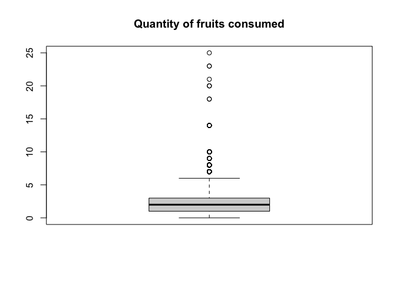
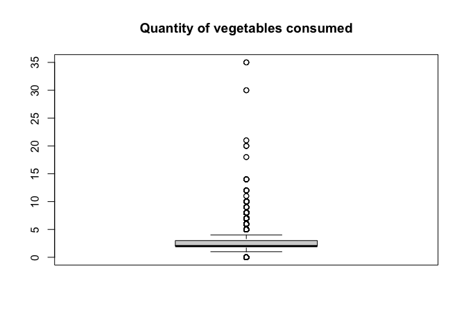
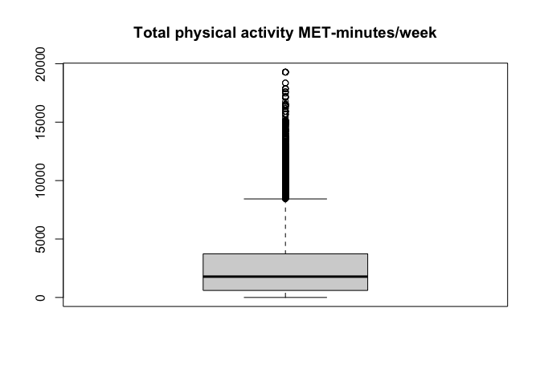
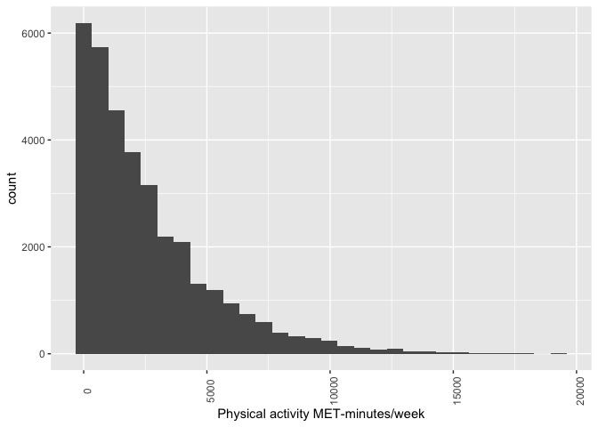
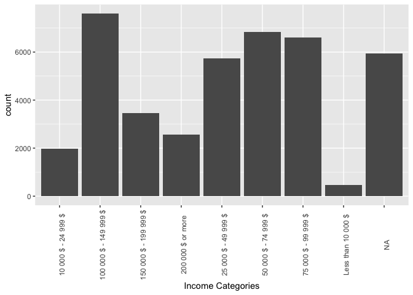
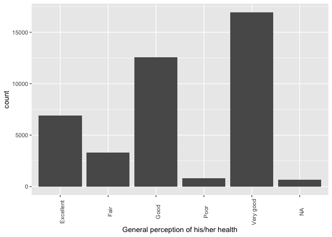

``` r
library(tidyverse)
```

```
## ── Attaching core tidyverse packages ──────────────────────── tidyverse 2.0.0 ──
## ✔ dplyr     1.1.4     ✔ readr     2.1.5
## ✔ forcats   1.0.0     ✔ stringr   1.5.1
## ✔ ggplot2   3.5.1     ✔ tibble    3.2.1
## ✔ lubridate 1.9.3     ✔ tidyr     1.3.1
## ✔ purrr     1.0.2     
## ── Conflicts ────────────────────────────────────────── tidyverse_conflicts() ──
## ✖ dplyr::filter() masks stats::filter()
## ✖ dplyr::lag()    masks stats::lag()
## ℹ Use the conflicted package (<http://conflicted.r-lib.org/>) to force all conflicts to become errors
```

``` r
library(knitr)
library(naniar)
```

#### **Assignment Tasks**

1.  **Data Cleaning**
    -   Load the provided datasets and examine their structure (e.g., columns, data types, unique values).
    # Load the Dataset:


``` r
can_path_demo<-read_csv("can_path_demographics.csv")
```

```
## Rows: 41187 Columns: 3
## ── Column specification ────────────────────────────────────────────────────────
## Delimiter: ","
## chr (1): ID
## dbl (2): SDC_GENDER, SDC_INCOME
## 
## ℹ Use `spec()` to retrieve the full column specification for this data.
## ℹ Specify the column types or set `show_col_types = FALSE` to quiet this message.
```

``` r
can_path_health<-read_csv("can_path_health.csv")
```

```
## Rows: 41187 Columns: 6
## ── Column specification ────────────────────────────────────────────────────────
## Delimiter: ","
## chr (1): ID
## dbl (5): HS_GEN_HEALTH, NUT_VEG_QTY, NUT_FRUITS_QTY, PA_TOTAL_SHORT, DIS_AST...
## 
## ℹ Use `spec()` to retrieve the full column specification for this data.
## ℹ Specify the column types or set `show_col_types = FALSE` to quiet this message.
```

# Examining the data structure:

**Demographic data**


``` r
glimpse(can_path_demo)
```

```
## Rows: 41,187
## Columns: 3
## $ ID         <chr> "SYN_58621", "SYN_58622", "SYN_58623", "SYN_58624", "SYN_58…
## $ SDC_GENDER <dbl> 2, 2, 2, 2, 2, 2, 2, 2, 2, 2, 1, 2, 2, 2, 2, 2, 2, 2, 2, 2,…
## $ SDC_INCOME <dbl> 6, 6, 4, 3, NA, 4, 5, 3, 3, 5, 8, NA, 3, 5, 4, 4, 4, NA, 4,…
```

``` r
unique(can_path_demo$SDC_GENDER)
```

```
## [1] 2 1
```

``` r
sapply(can_path_demo, class)
```

```
##          ID  SDC_GENDER  SDC_INCOME 
## "character"   "numeric"   "numeric"
```
**Health Data**


``` r
glimpse(can_path_health)
```

```
## Rows: 41,187
## Columns: 6
## $ ID              <chr> "SYN_58621", "SYN_58622", "SYN_58623", "SYN_58624", "S…
## $ HS_GEN_HEALTH   <dbl> 3, 4, 3, 4, 3, 5, 5, 3, 3, 4, 4, 4, 4, 5, 5, 3, 4, NA,…
## $ NUT_VEG_QTY     <dbl> 3, 0, 5, 1, 2, 5, 3, 5, 8, 1, 1, 3, 2, 2, 3, 1, 4, NA,…
## $ NUT_FRUITS_QTY  <dbl> 1, 0, 3, 3, 3, 5, 3, 2, 5, 0, 1, 5, 3, 1, 2, 1, 3, NA,…
## $ PA_TOTAL_SHORT  <dbl> 3564.0, 0.0, NA, 594.0, NA, NA, 2118.0, 297.0, NA, 240…
## $ DIS_ASTHMA_EVER <dbl> 0, 0, 2, 0, 1, 2, 0, NA, 0, 0, NA, 0, 0, 0, 0, 0, 0, 0…
```

``` r
sapply(can_path_health, class)
```

```
##              ID   HS_GEN_HEALTH     NUT_VEG_QTY  NUT_FRUITS_QTY  PA_TOTAL_SHORT 
##     "character"       "numeric"       "numeric"       "numeric"       "numeric" 
## DIS_ASTHMA_EVER 
##       "numeric"
```

There are three columns or variables which are ID, SDC_GENDER and SDC_INCOME in Demographic data set and there are 6 columns or variable which are ID, HS_GEN_HEALTH, NUT_VEG_QTY, NUT_FRUITS_QTY PA_TOTAL_SHORT  DIS_ASTHMA_EVER. both data sets have 41,187 rows or observation. All variables are treated as *dbl* except ID.

**Unique value in the variable**

``` r
unique_value <- data.frame(
  Varialbe_Name = c("SDC_GENDER", "SDC_INCOME","HS_GEN_HEALTH",
                    "NUT_VEG_QTY","NUT_FRUITS_QTY","PA_TOTAL_SHOR",
                    "DIS_ASTHMA_EVER"),  # Character column
  Unique_Value = c(paste(unique(can_path_demo$SDC_GENDER), collapse = ", "), 
                   paste(sort(unique(can_path_demo$SDC_INCOME), na.last = TRUE), collapse = ","),
                   paste(sort(unique(can_path_health$HS_GEN_HEALTH), na.last = TRUE), collapse = ", "),
                   paste(sort(unique(can_path_health$NUT_VEG_QTY), na.last = TRUE), collapse = ", "),
                   paste(sort(unique(can_path_health$NUT_FRUITS_QTY), na.last = TRUE), collapse = ", "),
                   paste(sort(unique(can_path_health$PA_TOTAL_SHOR), na.last = TRUE), collapse = ", "),
                   paste(sort(unique(can_path_health$DIS_ASTHMA_EVER), na.last = TRUE), collapse = ", ")
                   )
)
```

```
## Warning: Unknown or uninitialised column: `PA_TOTAL_SHOR`.
```

``` r
colnames(unique_value)<-c("Variable Name", "Unique Value")
kable(unique_value)
```


|Variable Name   |Unique Value                                                         |
|:---------------|:--------------------------------------------------------------------|
|SDC_GENDER      |2, 1                                                                 |
|SDC_INCOME      |1,2,3,4,5,6,7,8,NA                                                   |
|HS_GEN_HEALTH   |1, 2, 3, 4, 5, NA                                                    |
|NUT_VEG_QTY     |0, 1, 2, 3, 4, 5, 6, 7, 8, 9, 10, 11, 12, 14, 18, 20, 21, 30, 35, NA |
|NUT_FRUITS_QTY  |0, 1, 2, 3, 4, 5, 6, 7, 8, 9, 10, 14, 18, 20, 21, 23, 25, NA         |
|PA_TOTAL_SHOR   |                                                                     |
|DIS_ASTHMA_EVER |0, 1, 2, NA                                                          |

-   Identify and correct issues such as outliers, duplicates, and inconsistent formatting. **outliers**

**Duplicates observation**


``` r
duplicates_demo <- can_path_demo[duplicated(can_path_demo),] #identify the duplicates ooservation
duplicates_health <- can_path_health[duplicated(can_path_health),] 
glimpse(duplicates_demo)
```

```
## Rows: 0
## Columns: 3
## $ ID         <chr> 
## $ SDC_GENDER <dbl> 
## $ SDC_INCOME <dbl>
```

``` r
glimpse(duplicates_health)
```

```
## Rows: 0
## Columns: 6
## $ ID              <chr> 
## $ HS_GEN_HEALTH   <dbl> 
## $ NUT_VEG_QTY     <dbl> 
## $ NUT_FRUITS_QTY  <dbl> 
## $ PA_TOTAL_SHORT  <dbl> 
## $ DIS_ASTHMA_EVER <dbl>
```
Here, the factor variable which is treated as numeric variable

-   Variable label of SDC_GENDER is Gender of the participant and value label of is

    -   1: Male,

    -   2: Female.

-   Variable label of SDC_INCOME is Average annual income, before taxes, of the participant's entire household including salaries, pensions, and allowances and value label is

    -   1: Less than 10 000 \$,

    -   2: 10 000 \$ - 24 999 \$,

    -   3 25 000 \$ - 49 999 \$,

    -   4 50 000 \$ - 74 999 \$,

    -   5 75 000 \$ - 99 999 \$,

    -   6 100 000 \$ - 149 999 \$,

    -   7 150 000 \$ - 199 999 \$,

    -   8 200 000 \$ or more.

-   Variable label of HS_GEN_HEALTH is the Participant's general perception of his/her health. and value label is

    -   1 Poor,

    -   2 Fair,

    -   3 Good,

    -   4 Very good,

    -   5 Excellent.
    
-   Variable label of DIS_ASTHMA_EVER is the Occurrence of asthma at any point during the life of the participant. and value label is

   -  0	Never had asthma,
   -  1	Ever had asthma,
   -  2 Presumed - Never had asthma
   
    
**Count or continuous variables -**

-   Variable label of NUT_FRUITS_QTY is Quantity of fruits consumed.

-   Variable label of NUT_VEG_QTY is Quantity of vegetables consumed.

-   Variable label of PA_TOTAL_SHORT is Total physical activity MET-minutes/week.

**Recoading Catagorical Variable**

``` r
can_path_demo <- can_path_demo %>% mutate_at(2:3, factor)
can_path_health <- can_path_health %>% mutate_at(2, factor)
can_path_health <- can_path_health %>% mutate_at(6, factor)
```

2.  **Joining Datasets**
    -   Combine tne two related datasets by performing appropriate join operations (e.g., inner join, left join).\

``` r
can_path <- full_join(can_path_demo, can_path_health, by = "ID", suffix = c("", ""))
```
    
    -   Ensure the resulting dataset maintains consistency and completeness.
    
**1 Check for Missing Values**

``` r
missing_table <- miss_var_summary(can_path)
print(missing_table)
```

```
## # A tibble: 8 × 3
##   variable        n_miss pct_miss
##   <chr>            <int>    <num>
## 1 PA_TOTAL_SHORT    6763    16.4 
## 2 SDC_INCOME        5934    14.4 
## 3 NUT_VEG_QTY       2549     6.19
## 4 NUT_FRUITS_QTY    2426     5.89
## 5 DIS_ASTHMA_EVER   1228     2.98
## 6 HS_GEN_HEALTH      672     1.63
## 7 ID                   0     0   
## 8 SDC_GENDER           0     0
```
**2. Check for Duplicates**

``` r
duplicates_canpath <- can_path_demo[duplicated(can_path),]
glimpse(duplicates_canpath)
```

```
## Rows: 0
## Columns: 3
## $ ID         <chr> 
## $ SDC_GENDER <fct> 
## $ SDC_INCOME <fct>
```
**3. Check for Outliers in Numerical Variables**

``` r
boxplot(can_path$NUT_FRUITS_QTY, main = "Quantity of fruits consumed")
```

<!-- -->

``` r
summary(can_path$NUT_FRUITS_QTY)
```

```
##    Min. 1st Qu.  Median    Mean 3rd Qu.    Max.    NA's 
##   0.000   1.000   2.000   2.132   3.000  25.000    2426
```

``` r
boxplot(can_path$NUT_VEG_QTY, main = "Quantity of vegetables consumed")
```

<!-- -->

``` r
summary(can_path$NUT_VEG_QTY,)
```

```
##    Min. 1st Qu.  Median    Mean 3rd Qu.    Max.    NA's 
##   0.000   2.000   2.000   2.672   3.000  35.000    2549
```

``` r
boxplot(can_path$PA_TOTAL_SHORT, main = "Total physical activity MET-minutes/week")
```

<!-- -->

``` r
summary(can_path$PA_TOTAL_SHORT)
```

```
##    Min. 1st Qu.  Median    Mean 3rd Qu.    Max.    NA's 
##       0     600    1782    2574    3732   19278    6763
```
The maximum value (25) for the quantity of fruits consumed is much higher than the 3rd quartile (3), indicating that the dataset contains extreme values.
The maximum value for the quantity of vegetables consumed is 35, which is significantly higher than the third quartile, indicating the presence of outliers.
For Physical activity, the maximum value of Physical activity MET-minutes/week (19278) is much higher than the 3rd quartile (3732), indicating extreme values in the dataset.

3.  **Descriptive Statistics**

    -   Calculate key statistics (e.g., mean, median, mode, variance, and standard deviation) for relevant variables.\

``` r
b<-round(mean(can_path$NUT_FRUITS_QTY,na.rm=TRUE),2)
c<-round(sd(can_path$NUT_FRUITS_QTY,na.rm=TRUE),2)
d<-round(median(can_path$NUT_FRUITS_QTY,na.rm=TRUE),2)
table <- tibble(Variable ="Quantity of fruits consumed" , Mean = b, SD = c, Median=d)
table<-rows_insert(table, tibble(Variable = "Quantity of vegetables consumed.", Mean = round(mean(can_path$NUT_VEG_QTY,na.rm=TRUE),2), SD=round(sd(can_path$NUT_VEG_QTY,na.rm=TRUE),2),
                                 Median=round(median(can_path$NUT_VEG_QTY,na.rm=TRUE),2)))
```

```
## Matching, by = "Variable"
```

``` r
table<-rows_insert(table, tibble(Variable = "Total physical activity MET-minutes/week", Mean = round(mean(can_path$PA_TOTAL_SHORT,na.rm=TRUE),2), SD=round(sd(can_path$PA_TOTAL_SHORT,na.rm=TRUE),2), Median=round(median(can_path$PA_TOTAL_SHORT,na.rm=TRUE),2)))
```

```
## Matching, by = "Variable"
```

``` r
knitr::kable(table, caption = "**Table 1: The Mean and Standard Deviation**", booktabs = TRUE)
```


Table: **Table 1: The Mean and Standard Deviation**

|Variable                                 |    Mean|      SD| Median|
|:----------------------------------------|-------:|-------:|------:|
|Quantity of fruits consumed              |    2.13|    1.41|      2|
|Quantity of vegetables consumed.         |    2.67|    1.68|      2|
|Total physical activity MET-minutes/week | 2574.09| 2656.19|   1782|
Table 1 represents the mean and standard Deviation of Fruits and vegetables consumption in a day and Total physical activity in a week. On average participants consumed 2.13 fruits with variability 1.41 (SD) and consumed 2.67 vegetable with variability 1.68 (SD). The average physical activity 2574.09 with variability 2656.19 (SD)

    -   Identify trends or anomalies based on these statistics.
    The table presents the mean, standard deviation (SD), and median for three variables: fruit consumption, vegetable consumption, and total physical activity. The mean quantity of fruits consumed is 2.13 with a standard deviation of 1.41, and the median is 2.00, indicating a relatively symmetric distribution. For vegetable consumption, the mean is higher at 2.67 with a standard deviation of 1.68, and the median is 2.00, suggesting a right-skewed distribution where some respondents consume significantly more vegetables. Total physical activity has a mean of 2574.09 MET-minutes/week with a high standard deviation of 2656.19, and the median is 1782, indicating a right-skewed distribution where some respondents engage in more physical activities. These statistics underscore differences in consumption patterns and the wide range of physical activity among respondents.
    
4.  **Data Visualization**
    -   Create at least three visualizations to highlight key findings.

``` r
pa_histo <- ggplot(can_path, aes(PA_TOTAL_SHORT)) + 
  geom_histogram() +
  labs(x = "Physical activity MET-minutes/week") + 
  theme(axis.text.x = element_text(angle = 90)) 
plot(pa_histo)
```

```
## `stat_bin()` using `bins = 30`. Pick better value with `binwidth`.
```

```
## Warning: Removed 6763 rows containing non-finite outside the scale range
## (`stat_bin()`).
```

<!-- -->
Interpretation: The graph shows the histogram of the Total physical activity MET-minutes/week. The data shows that as the values of “total physical activity MET-minutes/week” increase, the frequency decreases significantly. The graph provides a clear visual representation of the distribution, highlighting the skewness of the data toward the lower end of the scale, which is positive skewed.


``` r
   can_path <- can_path %>%
    	mutate(sdc_income_recode = case_when(
    		SDC_INCOME == 1 ~ "Less than 10 000 $",
        SDC_INCOME == 2 ~ "10 000 $ - 24 999 $",
    		SDC_INCOME == 3 ~ "25 000 $ - 49 999 $",
        SDC_INCOME == 4 ~ "50 000 $ - 74 999 $",
    		SDC_INCOME == 5 ~ "75 000 $ - 99 999 $",
        SDC_INCOME == 6 ~ "100 000 $ - 149 999 $",
    		SDC_INCOME == 7 ~ "150 000 $ - 199 999 $",
        SDC_INCOME == 8 ~ "200 000 $ or more",
    	))

bar_income <- ggplot(can_path, aes(sdc_income_recode)) + 
                geom_bar() + 
                labs(x = "Income Categories") + 
                theme(axis.text.x = element_text(angle = 90))       
plot(bar_income)
```

<!-- -->


The bar diagram illustrates the income distribution of respondents, with the highest frequency observed in the income bracket of $100,000−$149,999. This is followed by the ranges $50,000−$74,999, $25,000−$49,999, and $75,000−$99,999, respectively. Additionally, there are approximately 6,000 cases where income data is missing, indicating a notable portion of the dataset lacks this information. This distribution highlights the prevalence of mid-to-high income earners among the respondents while underscoring the need to address missing data for a more comprehensive analysis.


``` r
    can_path <- can_path %>%
    	mutate(sdc_gen_health_recode = case_when(
    		HS_GEN_HEALTH == 1 ~ "Poor",
        HS_GEN_HEALTH == 2 ~ "Fair",
    		HS_GEN_HEALTH == 3 ~ "Good",
        HS_GEN_HEALTH == 4 ~ "Very good",
    		HS_GEN_HEALTH == 5 ~ "Excellent"
    	))

bar_GH <- ggplot(can_path, aes(sdc_gen_health_recode)) + 
                geom_bar() + 
                labs(x = "General perception of his/her health") + 
                theme(axis.text.x = element_text(angle = 90))       
plot(bar_GH)
```

<!-- -->

The bar graph illustrates the respondents’ general perception of health, categorized into five levels: Excellent, Very Good, Good, Fair, and Poor. The highest bar corresponds to "Good," indicating that most respondents perceive their health as good. This is followed by "Very Good" and "Excellent," suggesting that the population has a positive outlook about their health. The categories "Fair" and "Poor" have notably lower bars, reflecting that fewer respondents perceive their health as fair or poor. Overall, the graph indicates a generally positive perception of health among the respondents, with most individuals rating their health as good or better.

