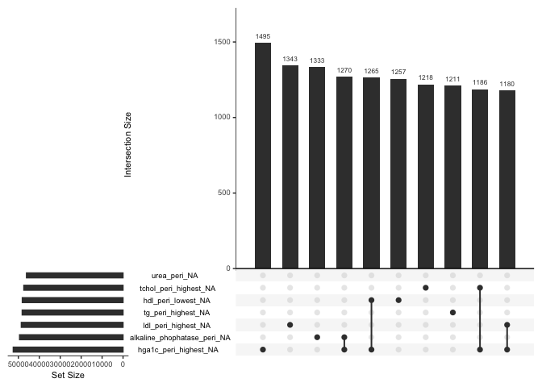

Data Wrangling

Load your dataset and examine its structure.
Perform cleaning tasks, including handling missing data, correcting inconsistencies, and ensuring appropriate data types.
Prepare the dataset for analysis by creating or transforming variables as necessary.

## Dataset Exploration 

Load and examine **the synthetic cohort of ~100,000 patients**.

``` r
data_synt <- read_excel("synthetic_data_stats_competition_2025_final.xlsx")
```

<!-- ```{r} -->
<!-- # glimpse(data_synt) -->

<!-- ``` -->


**Check the structure of the dataset**


``` r
dim(data_synt)
```

```
## [1] 106747    138
```

``` r
df_info <- data.frame(
  Variable = names(data_synt), 
  Type = sapply(data_synt, class)  # Gets the data type of each variable
)
print(df_info, row.names = FALSE)  # Print full output
```

```
##                                       Variable      Type
##                                     patient_id character
##                     demographics_age_index_ecg   numeric
##                         demographics_birth_sex   numeric
##                             hypertension_icd10   numeric
##                              diabetes_combined   numeric
##                          dyslipidemia_combined   numeric
##                                      dcm_icd10   numeric
##                                      hcm_icd10   numeric
##                        myocarditis_icd10_prior   numeric
##                       pericarditis_icd10_prior   numeric
##                          aortic_aneurysm_icd10   numeric
##                  aortic_dissection_icd10_prior   numeric
##                            pulmonary_htn_icd10   numeric
##                                  amyloid_icd10   numeric
##                                     copd_icd10   numeric
##                 obstructive _sleep_apnea_icd10   numeric
##                             hyperthyroid_icd10   numeric
##                              hypothyroid_icd10   numeric
##                     rheumatoid_arthritis_icd10   numeric
##                                      sle_icd10   numeric
##                                  sarcoid_icd10   numeric
##                               cancer_any_icd10   numeric
##              event_cv_hf_admission_icd10_prior   numeric
##          event_cv_cad_acs_acute_mi_icd10_prior   numeric
##   event_cv_cad_acs_unstable_angina_icd10_prior   numeric
##             event_cv_cad_acs_other_icd10_prior   numeric
##                 event_cv_ep_vt_any_icd10_prior   numeric
##       event_cv_ep_sca_survived_icd10_cci_prior   numeric
##       event_cv_cns_stroke_ischemic_icd10_prior   numeric
##        event_cv_cns_stroke_hemorrh_icd10_prior   numeric
##                   event_cv_cns_tia_icd10_prior   numeric
##                                      pci_prior   numeric
##                                     cabg_prior   numeric
##                     transplant_heart_cci_prior   numeric
##                                 lvad_cci_prior   numeric
##                  pacemaker_permanent_cci_prior   numeric
##                                  crt_cci_prior   numeric
##                                  icd_cci_prior   numeric
##                                 ecg_resting_hr   numeric
##                                 ecg_resting_pr   numeric
##                                ecg_resting_qrs   numeric
##                                ecg_resting_qtc   numeric
##                               ecg_resting_afib   numeric
##                           ecg_resting_aflutter   numeric
##                              ecg_resting_paced   numeric
##                           ecg_resting_bigeminy   numeric
##                               ecg_resting_LBBB   numeric
##                               ecg_resting_RBBB   numeric
##                    ecg_resting_incomplete_LBBB   numeric
##                    ecg_resting_incomplete_RBBB   numeric
##                               ecg_resting_LAFB   numeric
##                               ecg_resting_LPFB   numeric
##                 ecg_resting_bifascicular_block   numeric
##                ecg_resting_trifascicular_block   numeric
##  ecg_resting_intraventricular_conduction_delay   numeric
##                                       hgb_peri   numeric
##                                       hct_peri   numeric
##                                       rdw_peri   numeric
##                                       wbc_peri   numeric
##                                       plt_peri   numeric
##                                       inr_peri   numeric
##                                       ptt_peri   numeric
##                                       esr_peri   numeric
##                        crp_high_sensitive_peri   numeric
##                                   albumin_peri   numeric
##                       alkaline_phophatase_peri   numeric
##                      alanine_transaminase_peri   numeric
##                    aspartate_transaminase_peri   numeric
##                           bilirubin_total_peri   numeric
##                          bilirubin_direct_peri   numeric
##                                      urea_peri   numeric
##                                creatinine_peri   numeric
##                        urine_alb_cr_ratio_peri   numeric
##                                    sodium_peri   numeric
##                                 potassium_peri   numeric
##                                  chloride_peri   numeric
##                                        ck_peri   numeric
##                     troponin_t_hs_peri_highest   numeric
##                          NTproBNP_peri_highest   numeric
##                   glucose_fasting_peri_highest   numeric
##                    glucose_random_peri_highest   numeric
##                             hga1c_peri_highest   numeric
##                             tchol_peri_highest   numeric
##                               ldl_peri_highest   numeric
##                                hdl_peri_lowest   numeric
##                                tg_peri_highest   numeric
##                                      iron_peri   numeric
##                                      tibc_peri   numeric
##                                  ferritin_peri   numeric
##                                       tsh_peri   numeric
##            anti_platelet_oral_non_asa_any_peri   numeric
##                   anti_coagulant_oral_any_peri   numeric
##                              nitrates_any_peri   numeric
##                                ranolazine_peri   numeric
##                                      acei_peri   numeric
##                                       arb_peri   numeric
##                             arni_entresto_peri   numeric
##                          beta_blocker_any_peri   numeric
##                                ivabradine_peri   numeric
##                               ccb_dihydro_peri   numeric
##                           ccb_non_dihydro_peri   numeric
##                             diuretic_loop_peri   numeric
##                         diuretic_thiazide_peri   numeric
##         diuretic_low_ceiling_non_thiazide_peri   numeric
##                       diuretic_metolazone_peri   numeric
##                       diuretic_indapamide_peri   numeric
##                              diuretic_mra_peri   numeric
##           diuretic_vasopressin_antagonist_peri   numeric
##                       anti_arrhythmic_any_peri   numeric
##                anti_arrhythmic_amiodarone_peri   numeric
##              anti_arrhythmic_disopyramide_peri   numeric
##                                   digoxin_peri   numeric
##            amyloid_therapeutics_tafamidis_peri   numeric
##           amyloid_therapeutics_diflunisal_peri   numeric
##            amyloid_therapeutics_patisiran_peri   numeric
##            amyloid_therapeutics_inotersen_peri   numeric
##                              lipid_statin_peri   numeric
##                             lipid_fibrate_peri   numeric
##                           lipid_ezetimibe_peri   numeric
##                              lipid_PCKSK9_peri   numeric
##                               lipid_other_peri   numeric
##                           glucose_insulin_peri   numeric
##                    glucose_glp_1_agonsist_peri   numeric
##                     glucose_ohg_biguanide_peri   numeric
##                     glucose_ohg_alphagluc_peri   numeric
##                         glucose_ohg_dpp_4_peri   numeric
##                        glucose_ohg_sglt_2_peri   numeric
##                  glucose_ohg_thiazolidine_peri   numeric
##                   glucose_ohg_repaglinide_peri   numeric
##                  glucose_ohg_sulfonylurea_peri   numeric
##                         glucose_ohg_other_peri   numeric
##                    smoking_cessation_oral_peri   numeric
##    smoking_cessation_nicotine_replacement_peri   numeric
##                 outcome_afib_aflutter_new_post   numeric
##         time_to_outcome_afib_aflutter_new_post   numeric
##                        outcome_all_cause_death   numeric
##                time_to_outcome_all_cause_death   numeric
##                             follow_up_duration   numeric
```

``` r
get_unique_values <- function(df, vars_to_exclude = NULL) {
  # Initialize results dataframe
  result <- data.frame(
    Variable_Name = character(),
    Unique_Values = character(),
    Is_Boolean = logical(),
    # Value_Count = integer(),
    stringsAsFactors = FALSE
  )
  
  # Get columns to analyze (excluding specified vars)
  cols_to_analyze <- setdiff(names(df), vars_to_exclude)
  
  for (col in cols_to_analyze) {
    # Get complete unique values (including NA)
    unique_vals <- unique(df[[col]])
    na_present <- any(is.na(unique_vals))
    na_sum<-sum(is.na(df[[col]]))
    na_sum_per<-((sum(is.na(df[[col]])))/length(df[[col]]))*100
    
    # Remove NA for boolean detection
    clean_vals <- unique_vals[!is.na(unique_vals)]
    val_count <- length(clean_vals)
    
    # Detect boolean variables (0/1 or 1/2 numeric)
    is_boolean <- if (val_count <= 2 && is.numeric(df[[col]])) {
      all(clean_vals %in% c(0, 1)) || all(clean_vals %in% c(1, 2))
    } else {
      FALSE
    }
    
    # Prepare values for display
    if (na_present) {
      display_vals <- c(sort(clean_vals), NA)
    } else {
      display_vals <- sort(clean_vals)
    }
    
    # Convert to character representation
    char_vals <- sapply(display_vals, function(x) {
      if (is.na(x)) "NA" else as.character(x)
    })
    
    result <- rbind(result, data.frame(
      Variable_Name = col,
      Unique_Values = paste(char_vals, collapse = ", "),
      Is_Boolean = is_boolean,
      Value_Count = val_count,
      missing=na_sum,
      missing_per=na_sum_per,
      stringsAsFactors = FALSE
    ))
  }
  
  return(result)
}
unique_values <- get_unique_values(data_synt)
table(unique_values$Is_Boolean)
```

```
## 
## FALSE  TRUE 
##    44    94
```

``` r
unique_values<- unique_values %>%
  filter(Variable_Name!="patient_id")
```
    138

This is a synthetic cohort of 106747 unique patients with 138 variables. All variables are numeric.  In this health administrative dataset, there are 41,187 observations and 138 variables. Among them 94 are categorical variable, 43 numeric variable.


**Missing Data Information**


``` r
missing_table <- miss_var_summary(data_synt)
missing_table
```

```
## # A tibble: 138 × 3
##    variable                               n_miss pct_miss
##    <chr>                                   <int>    <num>
##  1 bilirubin_direct_peri                  105668     99.0
##  2 crp_high_sensitive_peri                103962     97.4
##  3 NTproBNP_peri_highest                  102515     96.0
##  4 time_to_outcome_afib_aflutter_new_post 100256     93.9
##  5 esr_peri                                96159     90.1
##  6 urine_alb_cr_ratio_peri                 92369     86.5
##  7 aspartate_transaminase_peri             89967     84.3
##  8 troponin_t_hs_peri_highest              79055     74.1
##  9 time_to_outcome_all_cause_death         78309     73.4
## 10 ck_peri                                 78306     73.4
## # ℹ 128 more rows
```
In this missing data **time_to_outcome_afib_aflutter_new_post** which is **Time from index 12 lead ECG to new onset atrial fibrillation/flutter**. This variable is blank if the patient did not develop the outcome and **time_to_outcome_all_cause_death** which is **Time from index 12 lead ECG to all cause death**. This variable is Blank if the patient did not die. So we can say that those missing is the conditional missing. so we can exclude them from missing variables. 


``` r
data_synt1 <- data_synt %>% 
  select(-c(time_to_outcome_afib_aflutter_new_post,time_to_outcome_all_cause_death))

vis_dat(data_synt1, warn_large_data = FALSE)
```

<!-- -->

``` r
# data_synt$time_to_outcome_afib_aflutter_new_post<-NULL
# data_synt$outcome_all_cause_death<-NULL
# data_synt$time_to_outcome_all_cause_death<-NULL
```

From this graph we can say that some specific variables which is the lab variables are missing. 


``` r
gg_miss_upset(data_synt1, order.by = "freq", nsets = 5,  nintersects = 10)
```

<!-- -->

``` r
gg_miss_upset(data_synt1, order.by = "freq", nsets = 6,  nintersects = 10)
```

<!-- -->

``` r
gg_miss_upset(data_synt1, order.by = "freq", nsets = 7,  nintersects = 10)
```

<!-- -->

``` r
gg_miss_upset(data_synt1, order.by = "freq", nsets = 8,  nintersects = 10)
```

<!-- -->

``` r
gg_miss_upset(data_synt1, order.by = "freq", nsets = 9,  nintersects = 10)
```

<!-- -->

``` r
gg_miss_upset(data_synt1, order.by = "freq", nsets = 10,  nintersects = 10)
```

<!-- -->

``` r
gg_miss_upset(data_synt1, order.by = "freq", nsets = 11,  nintersects = 10)
```

<!-- -->
We are examining patterns in missing data to identify potential relationships between variables. A notable trend emerges with the laboratory variables, which frequently show missing values together. This pattern of missingness appears meaningful and may reflect genuine data characteristics rather than random omissions. The systematic nature of these missing values suggests there are understandable reasons behind these gaps in the data.

Although the proportion of missing data can influence statistical inference, there are no universally accepted guidelines for the maximum amount of missing data for which multiple imputation (MI) remains beneficial. One study suggests that when over 10% of data are missing, the estimates may become biased [@bennett2001can]. Another paper proposes 5% as a threshold, below which MI is unlikely to provide significant benefits [@schafer1999multiple]. However, limited evidence exists to support these cutoff points. Few studies have explored how bias and efficiency change with increasing levels of missing data, with the most extreme case being 50% missing data, which showed growing inconsistency in effect estimates as missingness increased [@mishra2014comparative] for the small sample. However, when both high missing data and large sample sizes are considered as missing data being at random (MAR) [@lee2012recovery]. In this analysis, I consider missing values with less than 50 percent in this dataset.

let's review filter out all variables with more than 50% missing.


``` r
data_synt1 <- data_synt1 %>%
          select(where(~sum(is.na(.x))/length(.x) < 0.50))
```

``` r
missing_table <- miss_var_summary(data_synt1)
missing_table
```

```
## # A tibble: 120 × 3
##    variable                    n_miss pct_miss
##    <chr>                        <int>    <num>
##  1 hga1c_peri_highest           52452     49.1
##  2 alkaline_phophatase_peri     49434     46.3
##  3 ldl_peri_highest             48603     45.5
##  4 tg_peri_highest              48187     45.1
##  5 hdl_peri_lowest              48132     45.1
##  6 tchol_peri_highest           47402     44.4
##  7 urea_peri                    46127     43.2
##  8 tsh_peri                     42648     40.0
##  9 glucose_random_peri_highest  39798     37.3
## 10 alanine_transaminase_peri    35778     33.5
## # ℹ 110 more rows
```


``` r
vis_dat(data_synt1, warn_large_data = FALSE)
```

<!-- -->

``` r
gg_miss_upset(data_synt1, order.by = "freq", nsets = 5,  nintersects = 10)
```

<!-- -->

``` r
gg_miss_upset(data_synt1, order.by = "freq", nsets = 6,  nintersects = 10)
```

<!-- -->

``` r
gg_miss_upset(data_synt1, order.by = "freq", nsets = 7,  nintersects = 10)
```

<!-- -->

``` r
gg_miss_upset(data_synt1, order.by = "freq", nsets = 8,  nintersects = 10)
```

<!-- -->

``` r
gg_miss_upset(data_synt1, order.by = "freq", nsets = 9,  nintersects = 10)
```

<!-- -->

``` r
gg_miss_upset(data_synt1, order.by = "freq", nsets = 10,  nintersects = 10)
```

<!-- -->

``` r
gg_miss_upset(data_synt1, order.by = "freq", nsets = 11,  nintersects = 10)
```

<!-- -->


``` r
factor_vars <- unique_values %>% 
  filter(Is_Boolean== TRUE) %>% 
  pull(Variable_Name)
data_synt1 <- data_synt1 %>% 
  mutate(across(any_of(factor_vars), as.factor))
```


**Apply Imputation Methods**


We have used Multiple Imputation by Chained Equations (MICE) to impute the missing data.

MICE is a robust method for handling missing data by creating multiple imputed datasets and combining the results. Here we consider 20 imputation and 5 number of iteration

<!-- ```{r} -->
<!-- imputed_data_mice <- mice(data_synt1, m = 20, seed = 567, maxit=5) -->
<!-- imputed_data_mice_c<-complete(imputed_data_mice) -->
<!-- ``` -->


