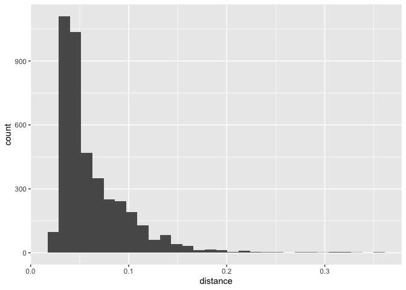
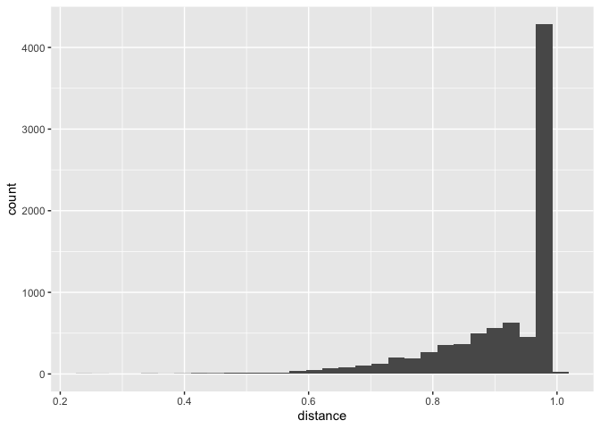

``` r
knitr::opts_chunk$set(echo = TRUE)
library(tidyverse)
library(adjustedCurves)
library(boot)
library(broom)
library(geepack)
library(here)
library(MatchIt)
library(tableone)
library(sjPlot)
library(survey)
library(episensr) 
library(epitools)
library(gtsummary)
library(cobalt)
library(cowplot)
library(geepack)
library(WeightIt)
```


``` r
data<-read.csv("mice_all_imp.csv")
```


``` r
data <- data %>% mutate_at(3, factor)
data <- data %>% mutate_at(5:6, factor)
data <- data %>% mutate_at(8:12, factor)
data <- data %>% mutate_at(15:81, factor)
data <- data %>% mutate_at(83:93, factor)
```


``` r
data <- data %>%
	mutate(diabetes = case_when(
		DIS_DIAB_EVER == 0 ~ 0,
		DIS_DIAB_EVER == 1 ~ 1,
		DIS_DIAB_EVER == 2 ~ 0)) %>%
		mutate(diabetes = as.factor(diabetes))

table(data$DIS_DIAB_EVER, data$diabetes)
```

```
##    
##         0     1
##   0 36714     0
##   1     0  3114
##   2  1359     0
```


``` r
data$DIS_DIAB_EVER <- NULL
```


``` r
table(data$HS_GEN_HEALTH)
```

```
## 
##     1     2     3     4     5 
##   832  3377 12783 17183  7012
```

``` r
### Combining levels 1 and 2 just to have enough sample. We won't do upscaling for this example
data <- data %>%
	mutate(gen_health = case_when(
		HS_GEN_HEALTH == 1 ~ 0,
		HS_GEN_HEALTH == 2 ~ 0,
		HS_GEN_HEALTH == 3 ~ 1,
		HS_GEN_HEALTH == 4 ~ 1,	
		HS_GEN_HEALTH == 5 ~ 1)) %>%
		mutate(gen_health = as.factor(gen_health))

table(data$HS_GEN_HEALTH, data$gen_health)
```

```
##    
##         0     1
##   1   832     0
##   2  3377     0
##   3     0 12783
##   4     0 17183
##   5     0  7012
```

``` r
data$HS_GEN_HEALTH <- NULL
```


## Unadjusted / Non-matched models


``` r
table(data$diabetes, data$gen_health)
```

```
##    
##         0     1
##   0  3367 34706
##   1   842  2272
```


``` r
#### Epi tools method
ghealth <- c("poor", "good")
outc <- c("Case", "Control")
dat <- matrix(c(3362, 34706, 842, 2272),2,2,byrow=TRUE)
dimnames(dat) <- list("health" = ghealth, "Outcome" = outc)
oddsratio(dat, rev="c")
```

```
## $data
##        Outcome
## health  Control Case Total
##   poor    34706 3362 38068
##   good     2272  842  3114
##   Total   36978 4204 41182
## 
## $measure
##       odds ratio with 95% C.I.
## health estimate    lower    upper
##   poor 1.000000       NA       NA
##   good 3.825877 3.506993 4.170731
## 
## $p.value
##       two-sided
## health midp.exact  fisher.exact    chi.square
##   poor         NA            NA            NA
##   good          0 1.483036e-171 2.109273e-228
## 
## $correction
## [1] FALSE
## 
## attr(,"method")
## [1] "median-unbiased estimate & mid-p exact CI"
```

``` r
#### Logistic regression
lr <- glm(diabetes ~ gen_health, data = data, family = "binomial")

tab_model(lr)
```

```
## Profiled confidence intervals may take longer time to compute.
##   Use `ci_method="wald"` for faster computation of CIs.
```

<table style="border-collapse:collapse; border:none;">
<tr>
<th style="border-top: double; text-align:center; font-style:normal; font-weight:bold; padding:0.2cm;  text-align:left; ">&nbsp;</th>
<th colspan="3" style="border-top: double; text-align:center; font-style:normal; font-weight:bold; padding:0.2cm; ">diabetes</th>
</tr>
<tr>
<td style=" text-align:center; border-bottom:1px solid; font-style:italic; font-weight:normal;  text-align:left; ">Predictors</td>
<td style=" text-align:center; border-bottom:1px solid; font-style:italic; font-weight:normal;  ">Odds Ratios</td>
<td style=" text-align:center; border-bottom:1px solid; font-style:italic; font-weight:normal;  ">CI</td>
<td style=" text-align:center; border-bottom:1px solid; font-style:italic; font-weight:normal;  ">p</td>
</tr>
<tr>
<td style=" padding:0.2cm; text-align:left; vertical-align:top; text-align:left; ">(Intercept)</td>
<td style=" padding:0.2cm; text-align:left; vertical-align:top; text-align:center;  ">0.25</td>
<td style=" padding:0.2cm; text-align:left; vertical-align:top; text-align:center;  ">0.23&nbsp;&ndash;&nbsp;0.27</td>
<td style=" padding:0.2cm; text-align:left; vertical-align:top; text-align:center;  "><strong>&lt;0.001</strong></td>
</tr>
<tr>
<td style=" padding:0.2cm; text-align:left; vertical-align:top; text-align:left; ">gen health [1]</td>
<td style=" padding:0.2cm; text-align:left; vertical-align:top; text-align:center;  ">0.26</td>
<td style=" padding:0.2cm; text-align:left; vertical-align:top; text-align:center;  ">0.24&nbsp;&ndash;&nbsp;0.29</td>
<td style=" padding:0.2cm; text-align:left; vertical-align:top; text-align:center;  "><strong>&lt;0.001</strong></td>
</tr>
<tr>
<td style=" padding:0.2cm; text-align:left; vertical-align:top; text-align:left; padding-top:0.1cm; padding-bottom:0.1cm; border-top:1px solid;">Observations</td>
<td style=" padding:0.2cm; text-align:left; vertical-align:top; padding-top:0.1cm; padding-bottom:0.1cm; text-align:left; border-top:1px solid;" colspan="3">41187</td>
</tr>
<tr>
<td style=" padding:0.2cm; text-align:left; vertical-align:top; text-align:left; padding-top:0.1cm; padding-bottom:0.1cm;">R<sup>2</sup> Tjur</td>
<td style=" padding:0.2cm; text-align:left; vertical-align:top; padding-top:0.1cm; padding-bottom:0.1cm; text-align:left;" colspan="3">0.025</td>
</tr>

</table>
The unadjusted logistic regression suggested that Health person 74% less likely to have diabetes compared to poor health condition. 


``` r
data_small <- select(data, diabetes, gen_health, SDC_AGE_CALC, SDC_EDU_LEVEL, PM_BMI_SR, WRK_FULL_TIME, SMK_CIG_EVER, SDC_INCOME, PA_TOTAL_SHORT, HS_ROUTINE_VISIT_EVER, PSE_ADULT_WRK_DURATION, DIS_RESP_SLEEP_APNEA_EVER, SDC_EDU_LEVEL_AGE, SDC_GENDER)
baselines<-colnames(data_small)


# covariates <- select(data, WRK_UNABLE, WRK_STUDENT, PSE_ADULT_WRK_DURATION, WH_CONTRACEPTIVES_EVER, SDC_INCOME, SDC_EDU_LEVEL_AGE, SDC_GENDER, SDC_AGE_CALC, SDC_HOUSEHOLD_ADULTS_NB, SDC_HOUSEHOLD_CHILDREN_NB)
# baselines <- colnames(covariates)
# baselines
```


``` r
tab_baseline <- CreateTableOne(vars = baselines,
                       data = data_small, 
                       strata = "gen_health", 
                       test = FALSE, #mute P-value calculation;
                       smd = TRUE,
                       addOverall = TRUE)

kableone(tab_baseline, smd = TRUE, showAllLevels = FALSE )
```


|                                   |Overall           |0                 |1                 |SMD   |
|:----------------------------------|:-----------------|:-----------------|:-----------------|:-----|
|n                                  |41187             |4209              |36978             |      |
|diabetes = 1 (%)                   |3114 ( 7.6)       |842 (20.0)        |2272 (  6.1)      |0.420 |
|gen_health = 1 (%)                 |36978 (89.8)      |0 ( 0.0)          |36978 (100.0)     |NaN   |
|SDC_AGE_CALC (mean (SD))           |51.48 (10.80)     |52.16 (10.78)     |51.40 (10.80)     |0.070 |
|SDC_EDU_LEVEL (%)                  |                  |                  |                  |0.346 |
|0                                  |79 ( 0.2)         |11 ( 0.3)         |68 (  0.2)        |      |
|1                                  |565 ( 1.4)        |128 ( 3.0)        |437 (  1.2)       |      |
|2                                  |7809 (19.0)       |1120 (26.6)       |6689 ( 18.1)      |      |
|3                                  |3486 ( 8.5)       |406 ( 9.6)        |3080 (  8.3)      |      |
|4                                  |10175 (24.7)      |1158 (27.5)       |9017 ( 24.4)      |      |
|5                                  |1795 ( 4.4)       |181 ( 4.3)        |1614 (  4.4)      |      |
|6                                  |11010 (26.7)      |789 (18.7)        |10221 ( 27.6)     |      |
|7                                  |6268 (15.2)       |416 ( 9.9)        |5852 ( 15.8)      |      |
|PM_BMI_SR (mean (SD))              |27.66 (6.22)      |29.71 (7.48)      |27.42 (6.01)      |0.337 |
|WRK_FULL_TIME = 1 (%)              |22307 (54.2)      |1855 (44.1)       |20452 ( 55.3)     |0.226 |
|SMK_CIG_EVER = 1 (%)               |18932 (46.0)      |2344 (55.7)       |16588 ( 44.9)     |0.218 |
|SDC_INCOME (%)                     |                  |                  |                  |0.537 |
|1                                  |574 ( 1.4)        |144 ( 3.4)        |430 (  1.2)       |      |
|2                                  |2447 ( 5.9)       |559 (13.3)        |1888 (  5.1)      |      |
|3                                  |6815 (16.5)       |1083 (25.7)       |5732 ( 15.5)      |      |
|4                                  |8008 (19.4)       |830 (19.7)        |7178 ( 19.4)      |      |
|5                                  |7667 (18.6)       |665 (15.8)        |7002 ( 18.9)      |      |
|6                                  |8826 (21.4)       |620 (14.7)        |8206 ( 22.2)      |      |
|7                                  |3965 ( 9.6)       |193 ( 4.6)        |3772 ( 10.2)      |      |
|8                                  |2885 ( 7.0)       |115 ( 2.7)        |2770 (  7.5)      |      |
|PA_TOTAL_SHORT (mean (SD))         |2606.47 (2691.81) |1910.77 (2452.99) |2685.66 (2706.38) |0.300 |
|HS_ROUTINE_VISIT_EVER = 1 (%)      |40651 (98.7)      |4149 (98.6)       |36502 ( 98.7)     |0.012 |
|PSE_ADULT_WRK_DURATION (mean (SD)) |6.69 (9.48)       |8.69 (10.52)      |6.46 (9.33)       |0.224 |
|DIS_RESP_SLEEP_APNEA_EVER (%)      |                  |                  |                  |0.203 |
|0                                  |35355 (85.8)      |3346 (79.5)       |32009 ( 86.6)     |      |
|1                                  |3916 ( 9.5)       |641 (15.2)        |3275 (  8.9)      |      |
|2                                  |1916 ( 4.7)       |222 ( 5.3)        |1694 (  4.6)      |      |
|SDC_EDU_LEVEL_AGE (mean (SD))      |25.34 (9.17)      |25.16 (10.00)     |25.36 (9.07)      |0.021 |
|SDC_GENDER = 2 (%)                 |25987 (63.1)      |2652 (63.0)       |23335 ( 63.1)     |0.002 |

## Nive regression 


``` r
fit_naive <- glm(diabetes ~ gen_health + SDC_AGE_CALC + SDC_EDU_LEVEL + PM_BMI_SR + WRK_FULL_TIME +SMK_CIG_EVER + SDC_INCOME + PA_TOTAL_SHORT + HS_ROUTINE_VISIT_EVER +PSE_ADULT_WRK_DURATION +DIS_RESP_SLEEP_APNEA_EVER+ SDC_EDU_LEVEL_AGE + SDC_GENDER, family = "binomial", data = data_small)

tab_model(fit_naive)
```

```
## Profiled confidence intervals may take longer time to compute.
##   Use `ci_method="wald"` for faster computation of CIs.
```

<table style="border-collapse:collapse; border:none;">
<tr>
<th style="border-top: double; text-align:center; font-style:normal; font-weight:bold; padding:0.2cm;  text-align:left; ">&nbsp;</th>
<th colspan="3" style="border-top: double; text-align:center; font-style:normal; font-weight:bold; padding:0.2cm; ">diabetes</th>
</tr>
<tr>
<td style=" text-align:center; border-bottom:1px solid; font-style:italic; font-weight:normal;  text-align:left; ">Predictors</td>
<td style=" text-align:center; border-bottom:1px solid; font-style:italic; font-weight:normal;  ">Odds Ratios</td>
<td style=" text-align:center; border-bottom:1px solid; font-style:italic; font-weight:normal;  ">CI</td>
<td style=" text-align:center; border-bottom:1px solid; font-style:italic; font-weight:normal;  ">p</td>
</tr>
<tr>
<td style=" padding:0.2cm; text-align:left; vertical-align:top; text-align:left; ">(Intercept)</td>
<td style=" padding:0.2cm; text-align:left; vertical-align:top; text-align:center;  ">0.03</td>
<td style=" padding:0.2cm; text-align:left; vertical-align:top; text-align:center;  ">0.01&nbsp;&ndash;&nbsp;0.06</td>
<td style=" padding:0.2cm; text-align:left; vertical-align:top; text-align:center;  "><strong>&lt;0.001</strong></td>
</tr>
<tr>
<td style=" padding:0.2cm; text-align:left; vertical-align:top; text-align:left; ">gen health [1]</td>
<td style=" padding:0.2cm; text-align:left; vertical-align:top; text-align:center;  ">0.32</td>
<td style=" padding:0.2cm; text-align:left; vertical-align:top; text-align:center;  ">0.30&nbsp;&ndash;&nbsp;0.35</td>
<td style=" padding:0.2cm; text-align:left; vertical-align:top; text-align:center;  "><strong>&lt;0.001</strong></td>
</tr>
<tr>
<td style=" padding:0.2cm; text-align:left; vertical-align:top; text-align:left; ">SDC AGE CALC</td>
<td style=" padding:0.2cm; text-align:left; vertical-align:top; text-align:center;  ">1.03</td>
<td style=" padding:0.2cm; text-align:left; vertical-align:top; text-align:center;  ">1.02&nbsp;&ndash;&nbsp;1.03</td>
<td style=" padding:0.2cm; text-align:left; vertical-align:top; text-align:center;  "><strong>&lt;0.001</strong></td>
</tr>
<tr>
<td style=" padding:0.2cm; text-align:left; vertical-align:top; text-align:left; ">SDC EDU LEVEL [1]</td>
<td style=" padding:0.2cm; text-align:left; vertical-align:top; text-align:center;  ">0.82</td>
<td style=" padding:0.2cm; text-align:left; vertical-align:top; text-align:center;  ">0.39&nbsp;&ndash;&nbsp;1.94</td>
<td style=" padding:0.2cm; text-align:left; vertical-align:top; text-align:center;  ">0.619</td>
</tr>
<tr>
<td style=" padding:0.2cm; text-align:left; vertical-align:top; text-align:left; ">SDC EDU LEVEL [2]</td>
<td style=" padding:0.2cm; text-align:left; vertical-align:top; text-align:center;  ">0.74</td>
<td style=" padding:0.2cm; text-align:left; vertical-align:top; text-align:center;  ">0.36&nbsp;&ndash;&nbsp;1.70</td>
<td style=" padding:0.2cm; text-align:left; vertical-align:top; text-align:center;  ">0.430</td>
</tr>
<tr>
<td style=" padding:0.2cm; text-align:left; vertical-align:top; text-align:left; ">SDC EDU LEVEL [3]</td>
<td style=" padding:0.2cm; text-align:left; vertical-align:top; text-align:center;  ">0.72</td>
<td style=" padding:0.2cm; text-align:left; vertical-align:top; text-align:center;  ">0.35&nbsp;&ndash;&nbsp;1.67</td>
<td style=" padding:0.2cm; text-align:left; vertical-align:top; text-align:center;  ">0.400</td>
</tr>
<tr>
<td style=" padding:0.2cm; text-align:left; vertical-align:top; text-align:left; ">SDC EDU LEVEL [4]</td>
<td style=" padding:0.2cm; text-align:left; vertical-align:top; text-align:center;  ">0.67</td>
<td style=" padding:0.2cm; text-align:left; vertical-align:top; text-align:center;  ">0.33&nbsp;&ndash;&nbsp;1.56</td>
<td style=" padding:0.2cm; text-align:left; vertical-align:top; text-align:center;  ">0.313</td>
</tr>
<tr>
<td style=" padding:0.2cm; text-align:left; vertical-align:top; text-align:left; ">SDC EDU LEVEL [5]</td>
<td style=" padding:0.2cm; text-align:left; vertical-align:top; text-align:center;  ">0.69</td>
<td style=" padding:0.2cm; text-align:left; vertical-align:top; text-align:center;  ">0.34&nbsp;&ndash;&nbsp;1.63</td>
<td style=" padding:0.2cm; text-align:left; vertical-align:top; text-align:center;  ">0.359</td>
</tr>
<tr>
<td style=" padding:0.2cm; text-align:left; vertical-align:top; text-align:left; ">SDC EDU LEVEL [6]</td>
<td style=" padding:0.2cm; text-align:left; vertical-align:top; text-align:center;  ">0.66</td>
<td style=" padding:0.2cm; text-align:left; vertical-align:top; text-align:center;  ">0.33&nbsp;&ndash;&nbsp;1.54</td>
<td style=" padding:0.2cm; text-align:left; vertical-align:top; text-align:center;  ">0.290</td>
</tr>
<tr>
<td style=" padding:0.2cm; text-align:left; vertical-align:top; text-align:left; ">SDC EDU LEVEL [7]</td>
<td style=" padding:0.2cm; text-align:left; vertical-align:top; text-align:center;  ">0.66</td>
<td style=" padding:0.2cm; text-align:left; vertical-align:top; text-align:center;  ">0.32&nbsp;&ndash;&nbsp;1.54</td>
<td style=" padding:0.2cm; text-align:left; vertical-align:top; text-align:center;  ">0.295</td>
</tr>
<tr>
<td style=" padding:0.2cm; text-align:left; vertical-align:top; text-align:left; ">PM BMI SR</td>
<td style=" padding:0.2cm; text-align:left; vertical-align:top; text-align:center;  ">1.03</td>
<td style=" padding:0.2cm; text-align:left; vertical-align:top; text-align:center;  ">1.03&nbsp;&ndash;&nbsp;1.04</td>
<td style=" padding:0.2cm; text-align:left; vertical-align:top; text-align:center;  "><strong>&lt;0.001</strong></td>
</tr>
<tr>
<td style=" padding:0.2cm; text-align:left; vertical-align:top; text-align:left; ">WRK FULL TIME [1]</td>
<td style=" padding:0.2cm; text-align:left; vertical-align:top; text-align:center;  ">0.93</td>
<td style=" padding:0.2cm; text-align:left; vertical-align:top; text-align:center;  ">0.85&nbsp;&ndash;&nbsp;1.01</td>
<td style=" padding:0.2cm; text-align:left; vertical-align:top; text-align:center;  ">0.074</td>
</tr>
<tr>
<td style=" padding:0.2cm; text-align:left; vertical-align:top; text-align:left; ">SMK CIG EVER [1]</td>
<td style=" padding:0.2cm; text-align:left; vertical-align:top; text-align:center;  ">1.05</td>
<td style=" padding:0.2cm; text-align:left; vertical-align:top; text-align:center;  ">0.97&nbsp;&ndash;&nbsp;1.14</td>
<td style=" padding:0.2cm; text-align:left; vertical-align:top; text-align:center;  ">0.224</td>
</tr>
<tr>
<td style=" padding:0.2cm; text-align:left; vertical-align:top; text-align:left; ">SDC INCOME [2]</td>
<td style=" padding:0.2cm; text-align:left; vertical-align:top; text-align:center;  ">1.11</td>
<td style=" padding:0.2cm; text-align:left; vertical-align:top; text-align:center;  ">0.82&nbsp;&ndash;&nbsp;1.53</td>
<td style=" padding:0.2cm; text-align:left; vertical-align:top; text-align:center;  ">0.501</td>
</tr>
<tr>
<td style=" padding:0.2cm; text-align:left; vertical-align:top; text-align:left; ">SDC INCOME [3]</td>
<td style=" padding:0.2cm; text-align:left; vertical-align:top; text-align:center;  ">0.97</td>
<td style=" padding:0.2cm; text-align:left; vertical-align:top; text-align:center;  ">0.73&nbsp;&ndash;&nbsp;1.31</td>
<td style=" padding:0.2cm; text-align:left; vertical-align:top; text-align:center;  ">0.842</td>
</tr>
<tr>
<td style=" padding:0.2cm; text-align:left; vertical-align:top; text-align:left; ">SDC INCOME [4]</td>
<td style=" padding:0.2cm; text-align:left; vertical-align:top; text-align:center;  ">0.91</td>
<td style=" padding:0.2cm; text-align:left; vertical-align:top; text-align:center;  ">0.68&nbsp;&ndash;&nbsp;1.24</td>
<td style=" padding:0.2cm; text-align:left; vertical-align:top; text-align:center;  ">0.539</td>
</tr>
<tr>
<td style=" padding:0.2cm; text-align:left; vertical-align:top; text-align:left; ">SDC INCOME [5]</td>
<td style=" padding:0.2cm; text-align:left; vertical-align:top; text-align:center;  ">0.85</td>
<td style=" padding:0.2cm; text-align:left; vertical-align:top; text-align:center;  ">0.64&nbsp;&ndash;&nbsp;1.15</td>
<td style=" padding:0.2cm; text-align:left; vertical-align:top; text-align:center;  ">0.283</td>
</tr>
<tr>
<td style=" padding:0.2cm; text-align:left; vertical-align:top; text-align:left; ">SDC INCOME [6]</td>
<td style=" padding:0.2cm; text-align:left; vertical-align:top; text-align:center;  ">0.79</td>
<td style=" padding:0.2cm; text-align:left; vertical-align:top; text-align:center;  ">0.59&nbsp;&ndash;&nbsp;1.08</td>
<td style=" padding:0.2cm; text-align:left; vertical-align:top; text-align:center;  ">0.131</td>
</tr>
<tr>
<td style=" padding:0.2cm; text-align:left; vertical-align:top; text-align:left; ">SDC INCOME [7]</td>
<td style=" padding:0.2cm; text-align:left; vertical-align:top; text-align:center;  ">0.86</td>
<td style=" padding:0.2cm; text-align:left; vertical-align:top; text-align:center;  ">0.63&nbsp;&ndash;&nbsp;1.19</td>
<td style=" padding:0.2cm; text-align:left; vertical-align:top; text-align:center;  ">0.345</td>
</tr>
<tr>
<td style=" padding:0.2cm; text-align:left; vertical-align:top; text-align:left; ">SDC INCOME [8]</td>
<td style=" padding:0.2cm; text-align:left; vertical-align:top; text-align:center;  ">0.77</td>
<td style=" padding:0.2cm; text-align:left; vertical-align:top; text-align:center;  ">0.56&nbsp;&ndash;&nbsp;1.08</td>
<td style=" padding:0.2cm; text-align:left; vertical-align:top; text-align:center;  ">0.128</td>
</tr>
<tr>
<td style=" padding:0.2cm; text-align:left; vertical-align:top; text-align:left; ">PA TOTAL SHORT</td>
<td style=" padding:0.2cm; text-align:left; vertical-align:top; text-align:center;  ">1.00</td>
<td style=" padding:0.2cm; text-align:left; vertical-align:top; text-align:center;  ">1.00&nbsp;&ndash;&nbsp;1.00</td>
<td style=" padding:0.2cm; text-align:left; vertical-align:top; text-align:center;  "><strong>0.002</strong></td>
</tr>
<tr>
<td style=" padding:0.2cm; text-align:left; vertical-align:top; text-align:left; ">HS ROUTINE VISIT EVER [1]</td>
<td style=" padding:0.2cm; text-align:left; vertical-align:top; text-align:center;  ">0.97</td>
<td style=" padding:0.2cm; text-align:left; vertical-align:top; text-align:center;  ">0.70&nbsp;&ndash;&nbsp;1.39</td>
<td style=" padding:0.2cm; text-align:left; vertical-align:top; text-align:center;  ">0.855</td>
</tr>
<tr>
<td style=" padding:0.2cm; text-align:left; vertical-align:top; text-align:left; ">PSE ADULT WRK DURATION</td>
<td style=" padding:0.2cm; text-align:left; vertical-align:top; text-align:center;  ">1.01</td>
<td style=" padding:0.2cm; text-align:left; vertical-align:top; text-align:center;  ">1.01&nbsp;&ndash;&nbsp;1.02</td>
<td style=" padding:0.2cm; text-align:left; vertical-align:top; text-align:center;  "><strong>&lt;0.001</strong></td>
</tr>
<tr>
<td style=" padding:0.2cm; text-align:left; vertical-align:top; text-align:left; ">DIS RESP SLEEP APNEA EVER<br>[1]</td>
<td style=" padding:0.2cm; text-align:left; vertical-align:top; text-align:center;  ">1.70</td>
<td style=" padding:0.2cm; text-align:left; vertical-align:top; text-align:center;  ">1.53&nbsp;&ndash;&nbsp;1.88</td>
<td style=" padding:0.2cm; text-align:left; vertical-align:top; text-align:center;  "><strong>&lt;0.001</strong></td>
</tr>
<tr>
<td style=" padding:0.2cm; text-align:left; vertical-align:top; text-align:left; ">DIS RESP SLEEP APNEA EVER<br>[2]</td>
<td style=" padding:0.2cm; text-align:left; vertical-align:top; text-align:center;  ">1.51</td>
<td style=" padding:0.2cm; text-align:left; vertical-align:top; text-align:center;  ">1.28&nbsp;&ndash;&nbsp;1.77</td>
<td style=" padding:0.2cm; text-align:left; vertical-align:top; text-align:center;  "><strong>&lt;0.001</strong></td>
</tr>
<tr>
<td style=" padding:0.2cm; text-align:left; vertical-align:top; text-align:left; ">SDC EDU LEVEL AGE</td>
<td style=" padding:0.2cm; text-align:left; vertical-align:top; text-align:center;  ">1.01</td>
<td style=" padding:0.2cm; text-align:left; vertical-align:top; text-align:center;  ">1.01&nbsp;&ndash;&nbsp;1.01</td>
<td style=" padding:0.2cm; text-align:left; vertical-align:top; text-align:center;  "><strong>&lt;0.001</strong></td>
</tr>
<tr>
<td style=" padding:0.2cm; text-align:left; vertical-align:top; text-align:left; ">SDC GENDER [2]</td>
<td style=" padding:0.2cm; text-align:left; vertical-align:top; text-align:center;  ">0.87</td>
<td style=" padding:0.2cm; text-align:left; vertical-align:top; text-align:center;  ">0.80&nbsp;&ndash;&nbsp;0.94</td>
<td style=" padding:0.2cm; text-align:left; vertical-align:top; text-align:center;  "><strong>0.001</strong></td>
</tr>
<tr>
<td style=" padding:0.2cm; text-align:left; vertical-align:top; text-align:left; padding-top:0.1cm; padding-bottom:0.1cm; border-top:1px solid;">Observations</td>
<td style=" padding:0.2cm; text-align:left; vertical-align:top; padding-top:0.1cm; padding-bottom:0.1cm; text-align:left; border-top:1px solid;" colspan="3">41187</td>
</tr>
<tr>
<td style=" padding:0.2cm; text-align:left; vertical-align:top; text-align:left; padding-top:0.1cm; padding-bottom:0.1cm;">R<sup>2</sup> Tjur</td>
<td style=" padding:0.2cm; text-align:left; vertical-align:top; padding-top:0.1cm; padding-bottom:0.1cm; text-align:left;" colspan="3">0.050</td>
</tr>

</table>


``` r
# 1:1 NN PS matching w/o replacement
kkn_1_1 <- matchit(gen_health ~ SDC_AGE_CALC + SDC_EDU_LEVEL + PM_BMI_SR + WRK_FULL_TIME +SMK_CIG_EVER + SDC_INCOME + PA_TOTAL_SHORT + HS_ROUTINE_VISIT_EVER +PSE_ADULT_WRK_DURATION +DIS_RESP_SLEEP_APNEA_EVER+ SDC_EDU_LEVEL_AGE + SDC_GENDER,
                  data = data_small,
                  method = "nearest",
                  distance = "glm")
```

```
## Warning: Fewer control units than treated units; not all treated units will get
## a match.
```

``` r
summary(kkn_1_1, un = FALSE)
```

```
## 
## Call:
## matchit(formula = gen_health ~ SDC_AGE_CALC + SDC_EDU_LEVEL + 
##     PM_BMI_SR + WRK_FULL_TIME + SMK_CIG_EVER + SDC_INCOME + PA_TOTAL_SHORT + 
##     HS_ROUTINE_VISIT_EVER + PSE_ADULT_WRK_DURATION + DIS_RESP_SLEEP_APNEA_EVER + 
##     SDC_EDU_LEVEL_AGE + SDC_GENDER, data = data_small, method = "nearest", 
##     distance = "glm")
## 
## Summary of Balance for Matched Data:
##                            Means Treated Means Control Std. Mean Diff.
## distance                          0.9749        0.8412          1.9275
## SDC_AGE_CALC                     50.6907       52.1563         -0.1357
## SDC_EDU_LEVEL0                    0.0000        0.0026         -0.0610
## SDC_EDU_LEVEL1                    0.0005        0.0304         -0.2770
## SDC_EDU_LEVEL2                    0.0506        0.2661         -0.5598
## SDC_EDU_LEVEL3                    0.0456        0.0965         -0.1840
## SDC_EDU_LEVEL4                    0.1121        0.2751         -0.3796
## SDC_EDU_LEVEL5                    0.0302        0.0430         -0.0628
## SDC_EDU_LEVEL6                    0.4405        0.1875          0.5658
## SDC_EDU_LEVEL7                    0.3205        0.0988          0.6073
## PM_BMI_SR                        24.1433       29.7109         -0.9263
## WRK_FULL_TIME0                    0.2661        0.5593         -0.5897
## WRK_FULL_TIME1                    0.7339        0.4407          0.5897
## SMK_CIG_EVER0                     0.7712        0.4431          0.6597
## SMK_CIG_EVER1                     0.2288        0.5569         -0.6597
## SDC_INCOME1                       0.0005        0.0342         -0.3147
## SDC_INCOME2                       0.0002        0.1328         -0.6023
## SDC_INCOME3                       0.0112        0.2573         -0.6801
## SDC_INCOME4                       0.0615        0.1972         -0.3430
## SDC_INCOME5                       0.1031        0.1580         -0.1401
## SDC_INCOME6                       0.2019        0.1473          0.1315
## SDC_INCOME7                       0.2880        0.0459          0.7999
## SDC_INCOME8                       0.3336        0.0273          1.1634
## PA_TOTAL_SHORT                 5751.7701     1910.7733          1.4192
## HS_ROUTINE_VISIT_EVER0            0.0097        0.0143         -0.0400
## HS_ROUTINE_VISIT_EVER1            0.9903        0.9857          0.0400
## PSE_ADULT_WRK_DURATION            3.5032        8.6900         -0.5560
## DIS_RESP_SLEEP_APNEA_EVER0        0.9513        0.7950          0.4584
## DIS_RESP_SLEEP_APNEA_EVER1        0.0192        0.1523         -0.4683
## DIS_RESP_SLEEP_APNEA_EVER2        0.0295        0.0527         -0.1114
## SDC_EDU_LEVEL_AGE                25.7337       25.1613          0.0631
## SDC_GENDER1                       0.3716        0.3699          0.0034
## SDC_GENDER2                       0.6284        0.6301         -0.0034
##                            Var. Ratio eCDF Mean eCDF Max Std. Pair Dist.
## distance                       0.0037    0.6347   0.9746          1.9275
## SDC_AGE_CALC                   0.7715    0.0390   0.0984          1.0963
## SDC_EDU_LEVEL0                      .    0.0026   0.0026          0.0610
## SDC_EDU_LEVEL1                      .    0.0299   0.0299          0.2858
## SDC_EDU_LEVEL2                      .    0.2155   0.2155          0.7536
## SDC_EDU_LEVEL3                      .    0.0508   0.0508          0.4832
## SDC_EDU_LEVEL4                      .    0.1630   0.1630          0.7647
## SDC_EDU_LEVEL5                      .    0.0128   0.0128          0.3442
## SDC_EDU_LEVEL6                      .    0.2530   0.2530          1.0567
## SDC_EDU_LEVEL7                      .    0.2217   0.2217          1.0031
## PM_BMI_SR                      0.3423    0.2471   0.3911          1.2794
## WRK_FULL_TIME0                      .    0.2932   0.2932          1.0542
## WRK_FULL_TIME1                      .    0.2932   0.2932          1.0542
## SMK_CIG_EVER0                       .    0.3281   0.3281          1.0830
## SMK_CIG_EVER1                       .    0.3281   0.3281          1.0830
## SDC_INCOME1                         .    0.0337   0.0337          0.3236
## SDC_INCOME2                         .    0.1326   0.1326          0.6023
## SDC_INCOME3                         .    0.2461   0.2461          0.7247
## SDC_INCOME4                         .    0.1357   0.1357          0.5761
## SDC_INCOME5                         .    0.0549   0.0549          0.5913
## SDC_INCOME6                         .    0.0546   0.0546          0.6941
## SDC_INCOME7                         .    0.2421   0.2421          1.0119
## SDC_INCOME8                         .    0.3062   0.3062          1.2879
## PA_TOTAL_SHORT                 2.3462    0.3895   0.5167          1.6139
## HS_ROUTINE_VISIT_EVER0              .    0.0045   0.0045          0.2129
## HS_ROUTINE_VISIT_EVER1              .    0.0045   0.0045          0.2129
## PSE_ADULT_WRK_DURATION         0.3855    0.1017   0.2618          0.9893
## DIS_RESP_SLEEP_APNEA_EVER0          .    0.1563   0.1563          0.6813
## DIS_RESP_SLEEP_APNEA_EVER1          .    0.1330   0.1330          0.5854
## DIS_RESP_SLEEP_APNEA_EVER2          .    0.0233   0.0233          0.3841
## SDC_EDU_LEVEL_AGE              0.4992    0.0391   0.2704          0.9761
## SDC_GENDER1                         .    0.0017   0.0017          0.9754
## SDC_GENDER2                         .    0.0017   0.0017          0.9754
## 
## Sample Sizes:
##           Control Treated
## All          4209   36978
## Matched      4209    4209
## Unmatched       0   32769
## Discarded       0       0
```
# histogram of propensity score


``` r
knn_data <- match.data(kkn_1_1)
ggplot(data = knn_data, aes(distance)) + 
        geom_histogram()
```

```
## `stat_bin()` using `bins = 30`. Pick better value with `binwidth`.
```

<!-- -->


# Matches


``` r
head(kkn_1_1$match.matrix)
```

```
##   [,1]
## 1 NA  
## 2 NA  
## 3 NA  
## 4 NA  
## 5 NA  
## 6 NA
```

``` r
love_knn <- love.plot(kkn_1_1, 
          binary = "std", 
          grid = TRUE,
          thresholds = c(m = .1),
          colors = c("red","blue"))  

plot(love_knn)
```

<!-- -->


``` r
bal.plot(kkn_1_1,
         var.name="distance",
         which="both",
         type = "density",
         colors = c("red","blue"))
```

<!-- -->
## full matching1


``` r
full <- matchit(gen_health ~ SDC_AGE_CALC + SDC_EDU_LEVEL + PM_BMI_SR + WRK_FULL_TIME +SMK_CIG_EVER + SDC_INCOME + PA_TOTAL_SHORT + HS_ROUTINE_VISIT_EVER +PSE_ADULT_WRK_DURATION +DIS_RESP_SLEEP_APNEA_EVER+ SDC_EDU_LEVEL_AGE + SDC_GENDER,
                  data = data_small,
                  method = "quick",
                  distance = "glm")
full
```

```
## A `matchit` object
##  - method: Generalized full matching
##  - distance: Propensity score
##              - estimated with logistic regression
##  - number of obs.: 41187 (original), 41187 (matched)
##  - target estimand: ATT
##  - covariates: SDC_AGE_CALC, SDC_EDU_LEVEL, PM_BMI_SR, WRK_FULL_TIME, SMK_CIG_EVER, SDC_INCOME, PA_TOTAL_SHORT, HS_ROUTINE_VISIT_EVER, PSE_ADULT_WRK_DURATION, DIS_RESP_SLEEP_APNEA_EVER, SDC_EDU_LEVEL_AGE, SDC_GENDER
```

``` r
summary(full, un = FALSE)
```

```
## 
## Call:
## matchit(formula = gen_health ~ SDC_AGE_CALC + SDC_EDU_LEVEL + 
##     PM_BMI_SR + WRK_FULL_TIME + SMK_CIG_EVER + SDC_INCOME + PA_TOTAL_SHORT + 
##     HS_ROUTINE_VISIT_EVER + PSE_ADULT_WRK_DURATION + DIS_RESP_SLEEP_APNEA_EVER + 
##     SDC_EDU_LEVEL_AGE + SDC_GENDER, data = data_small, method = "quick", 
##     distance = "glm")
## 
## Summary of Balance for Matched Data:
##                            Means Treated Means Control Std. Mean Diff.
## distance                          0.9043        0.9042          0.0002
## SDC_AGE_CALC                     51.4031       52.2228         -0.0759
## SDC_EDU_LEVEL0                    0.0018        0.0031         -0.0290
## SDC_EDU_LEVEL1                    0.0118        0.0110          0.0072
## SDC_EDU_LEVEL2                    0.1809        0.1847         -0.0100
## SDC_EDU_LEVEL3                    0.0833        0.0877         -0.0160
## SDC_EDU_LEVEL4                    0.2438        0.2362          0.0178
## SDC_EDU_LEVEL5                    0.0436        0.0467         -0.0148
## SDC_EDU_LEVEL6                    0.2764        0.2666          0.0220
## SDC_EDU_LEVEL7                    0.1583        0.1640         -0.0156
## PM_BMI_SR                        27.4218       27.4180          0.0006
## WRK_FULL_TIME0                    0.4469        0.4615         -0.0293
## WRK_FULL_TIME1                    0.5531        0.5385          0.0293
## SMK_CIG_EVER0                     0.5514        0.5517         -0.0006
## SMK_CIG_EVER1                     0.4486        0.4483          0.0006
## SDC_INCOME1                       0.0116        0.0138         -0.0205
## SDC_INCOME2                       0.0511        0.0553         -0.0192
## SDC_INCOME3                       0.1550        0.1579         -0.0079
## SDC_INCOME4                       0.1941        0.1976         -0.0089
## SDC_INCOME5                       0.1894        0.1977         -0.0214
## SDC_INCOME6                       0.2219        0.2177          0.0101
## SDC_INCOME7                       0.1020        0.0937          0.0273
## SDC_INCOME8                       0.0749        0.0662          0.0331
## PA_TOTAL_SHORT                 2685.6588     2896.3685         -0.0779
## HS_ROUTINE_VISIT_EVER0            0.0129        0.0117          0.0106
## HS_ROUTINE_VISIT_EVER1            0.9871        0.9883         -0.0106
## PSE_ADULT_WRK_DURATION            6.4589        6.7918         -0.0357
## DIS_RESP_SLEEP_APNEA_EVER0        0.8656        0.8575          0.0237
## DIS_RESP_SLEEP_APNEA_EVER1        0.0886        0.0983         -0.0342
## DIS_RESP_SLEEP_APNEA_EVER2        0.0458        0.0442          0.0078
## SDC_EDU_LEVEL_AGE                25.3637       25.5876         -0.0247
## SDC_GENDER1                       0.3689        0.3862         -0.0357
## SDC_GENDER2                       0.6311        0.6138          0.0357
##                            Var. Ratio eCDF Mean eCDF Max Std. Pair Dist.
## distance                       0.9989    0.0002   0.0052          0.0011
## SDC_AGE_CALC                   1.0331    0.0182   0.0371          1.1359
## SDC_EDU_LEVEL0                      .    0.0012   0.0012          0.1152
## SDC_EDU_LEVEL1                      .    0.0008   0.0008          0.2084
## SDC_EDU_LEVEL2                      .    0.0039   0.0039          0.7255
## SDC_EDU_LEVEL3                      .    0.0044   0.0044          0.5644
## SDC_EDU_LEVEL4                      .    0.0076   0.0076          0.8353
## SDC_EDU_LEVEL5                      .    0.0030   0.0030          0.4194
## SDC_EDU_LEVEL6                      .    0.0098   0.0098          0.8272
## SDC_EDU_LEVEL7                      .    0.0057   0.0057          0.6888
## PM_BMI_SR                      0.9181    0.0158   0.0401          1.0122
## WRK_FULL_TIME0                      .    0.0146   0.0146          0.9304
## WRK_FULL_TIME1                      .    0.0146   0.0146          0.9304
## SMK_CIG_EVER0                       .    0.0003   0.0003          0.9061
## SMK_CIG_EVER1                       .    0.0003   0.0003          0.9061
## SDC_INCOME1                         .    0.0022   0.0022          0.2309
## SDC_INCOME2                         .    0.0042   0.0042          0.3819
## SDC_INCOME3                         .    0.0029   0.0029          0.6303
## SDC_INCOME4                         .    0.0035   0.0035          0.7602
## SDC_INCOME5                         .    0.0084   0.0084          0.7766
## SDC_INCOME6                         .    0.0042   0.0042          0.7858
## SDC_INCOME7                         .    0.0083   0.0083          0.5354
## SDC_INCOME8                         .    0.0087   0.0087          0.4509
## PA_TOTAL_SHORT                 0.6843    0.0301   0.0697          0.9473
## HS_ROUTINE_VISIT_EVER0              .    0.0012   0.0012          0.2134
## HS_ROUTINE_VISIT_EVER1              .    0.0012   0.0012          0.2134
## PSE_ADULT_WRK_DURATION         0.9913    0.0079   0.0238          0.9371
## DIS_RESP_SLEEP_APNEA_EVER0          .    0.0081   0.0081          0.6708
## DIS_RESP_SLEEP_APNEA_EVER1          .    0.0097   0.0097          0.5673
## DIS_RESP_SLEEP_APNEA_EVER2          .    0.0016   0.0016          0.4108
## SDC_EDU_LEVEL_AGE              0.9439    0.0064   0.0293          1.0000
## SDC_GENDER1                         .    0.0172   0.0172          0.9668
## SDC_GENDER2                         .    0.0172   0.0172          0.9668
## 
## Sample Sizes:
##               Control Treated
## All           4209.     36978
## Matched (ESS) 1640.43   36978
## Matched       4209.     36978
## Unmatched        0.         0
## Discarded        0.         0
```

``` r
full_data <- match.data(full)
```

``` r
love_full <- love.plot(full, 
                binary = "std", 
                grid = TRUE,
                thresholds = c(m = .1),
                colors = c("red","blue"))

plot(love_full)
```

<!-- -->


``` r
plot_grid(love_full, love_knn, ncol = 1, nrow = 2, labels = c('Full', 'KNN'))
```

<!-- -->

The covariate balance plot demonstrates that full matching successfully achieved equilibrium between groups, with post-matching standardized mean differences (SMDs) converging near zero across all variables—a marked improvement over the pre-matching imbalances (peak SMDs ≈ ±0.5). This indicates the matched cohorts attained comparability on observed confounders, strengthening the validity of subsequent effect estimates. While the results suggest robust handling of measured covariates, residual bias from unobserved variables remains possible. The tight clustering of SMDs around zero post-adjustment underscores the efficacy of full matching in mitigating selection bias for this analysis.


``` r
full_data$diabetes <- as.numeric(full_data$diabetes)
full_data <- full_data %>%
	mutate(diabetes = case_when(
		diabetes == 1 ~ 0,
		diabetes == 2 ~ 1)) 
```


``` r
fit_no_cov <- geeglm(diabetes ~ gen_health, family=binomial("log"), 
              data=full_data,
              weights=weights, ### Weights
              std.err = 'san.se', ### Equivalent to robust standard errors 
              id=subclass, #### Group by subclasses
              corstr="independence") #### Specify correlation structure
```

```
## Warning in eval(family$initialize): non-integer #successes in a binomial glm!
```

``` r
tab_model(fit_no_cov)
```

```
## Profiled confidence intervals may take longer time to compute.
##   Use `ci_method="wald"` for faster computation of CIs.
```

<table style="border-collapse:collapse; border:none;">
<tr>
<th style="border-top: double; text-align:center; font-style:normal; font-weight:bold; padding:0.2cm;  text-align:left; ">&nbsp;</th>
<th colspan="3" style="border-top: double; text-align:center; font-style:normal; font-weight:bold; padding:0.2cm; ">diabetes</th>
</tr>
<tr>
<td style=" text-align:center; border-bottom:1px solid; font-style:italic; font-weight:normal;  text-align:left; ">Predictors</td>
<td style=" text-align:center; border-bottom:1px solid; font-style:italic; font-weight:normal;  ">Risk Ratios</td>
<td style=" text-align:center; border-bottom:1px solid; font-style:italic; font-weight:normal;  ">CI</td>
<td style=" text-align:center; border-bottom:1px solid; font-style:italic; font-weight:normal;  ">p</td>
</tr>
<tr>
<td style=" padding:0.2cm; text-align:left; vertical-align:top; text-align:left; ">(Intercept)</td>
<td style=" padding:0.2cm; text-align:left; vertical-align:top; text-align:center;  ">0.18</td>
<td style=" padding:0.2cm; text-align:left; vertical-align:top; text-align:center;  ">0.16&nbsp;&ndash;&nbsp;0.20</td>
<td style=" padding:0.2cm; text-align:left; vertical-align:top; text-align:center;  "><strong>&lt;0.001</strong></td>
</tr>
<tr>
<td style=" padding:0.2cm; text-align:left; vertical-align:top; text-align:left; ">gen health [1]</td>
<td style=" padding:0.2cm; text-align:left; vertical-align:top; text-align:center;  ">0.34</td>
<td style=" padding:0.2cm; text-align:left; vertical-align:top; text-align:center;  ">0.31&nbsp;&ndash;&nbsp;0.38</td>
<td style=" padding:0.2cm; text-align:left; vertical-align:top; text-align:center;  "><strong>&lt;0.001</strong></td>
</tr>

<tr>
<td style=" padding:0.2cm; text-align:left; vertical-align:top; text-align:left; padding-top:0.1cm; padding-bottom:0.1cm;">N <sub>subclass</sub></td>
<td style=" padding:0.2cm; text-align:left; vertical-align:top; padding-top:0.1cm; padding-bottom:0.1cm; text-align:left;" colspan="3">4015</td>
<tr>
<td style=" padding:0.2cm; text-align:left; vertical-align:top; text-align:left; padding-top:0.1cm; padding-bottom:0.1cm; border-top:1px solid;">Observations</td>
<td style=" padding:0.2cm; text-align:left; vertical-align:top; padding-top:0.1cm; padding-bottom:0.1cm; text-align:left; border-top:1px solid;" colspan="3">41187</td>
</tr>

</table>
## inverse probability treatment 


``` r
IPTW <- weightit(gen_health ~ SDC_AGE_CALC + SDC_EDU_LEVEL + PM_BMI_SR + WRK_FULL_TIME +SMK_CIG_EVER + SDC_INCOME + PA_TOTAL_SHORT + HS_ROUTINE_VISIT_EVER +PSE_ADULT_WRK_DURATION +DIS_RESP_SLEEP_APNEA_EVER+ SDC_EDU_LEVEL_AGE + SDC_GENDER,
                 data = data_small,
                 method = "glm", #using the default logistic regression;
                 stabilize = TRUE,
                 estimand = "ATE")

IPTW
```

```
## A weightit object
##  - method: "glm" (propensity score weighting with GLM)
##  - number of obs.: 41187
##  - sampling weights: none
##  - treatment: 2-category
##  - estimand: ATE
##  - covariates: SDC_AGE_CALC, SDC_EDU_LEVEL, PM_BMI_SR, WRK_FULL_TIME, SMK_CIG_EVER, SDC_INCOME, PA_TOTAL_SHORT, HS_ROUTINE_VISIT_EVER, PSE_ADULT_WRK_DURATION, DIS_RESP_SLEEP_APNEA_EVER, SDC_EDU_LEVEL_AGE, SDC_GENDER
```

``` r
summary(IPTW)
```

```
##                   Summary of weights
## 
## - Weight ranges:
## 
##      Min                                   Max
## 0 0.1325 |---------------------------| 12.3229
## 1 0.9010   |--|                         2.5003
## 
## - Units with the 5 most extreme weights by group:
##                                       
##     34757  40358  38924  20187   40235
##  0 6.2529 7.6807 8.4657 8.5577 12.3229
##     21625   1680   1646  24269   33839
##  1 2.3627 2.4033 2.4637 2.4759  2.5003
## 
## - Weight statistics:
## 
##   Coef of Var   MAD Entropy # Zeros
## 0       0.797 0.544   0.240       0
## 1       0.096 0.062   0.004       0
## 
## - Effective Sample Sizes:
## 
##                  0        1
## Unweighted 4209.   36978.  
## Weighted   2573.17 36638.78
```

``` r
model_iptw <- glm_weightit(diabetes ~ gen_health, 
            family = "binomial",
            weightit = IPTW,
            data = data_small)

tab_model(model_iptw)
```

```
## Profiled confidence intervals may take longer time to compute.
##   Use `ci_method="wald"` for faster computation of CIs.
```

<table style="border-collapse:collapse; border:none;">
<tr>
<th style="border-top: double; text-align:center; font-style:normal; font-weight:bold; padding:0.2cm;  text-align:left; ">&nbsp;</th>
<th colspan="3" style="border-top: double; text-align:center; font-style:normal; font-weight:bold; padding:0.2cm; ">diabetes</th>
</tr>
<tr>
<td style=" text-align:center; border-bottom:1px solid; font-style:italic; font-weight:normal;  text-align:left; ">Predictors</td>
<td style=" text-align:center; border-bottom:1px solid; font-style:italic; font-weight:normal;  ">Odds Ratios</td>
<td style=" text-align:center; border-bottom:1px solid; font-style:italic; font-weight:normal;  ">CI</td>
<td style=" text-align:center; border-bottom:1px solid; font-style:italic; font-weight:normal;  ">p</td>
</tr>
<tr>
<td style=" padding:0.2cm; text-align:left; vertical-align:top; text-align:left; ">(Intercept)</td>
<td style=" padding:0.2cm; text-align:left; vertical-align:top; text-align:center;  ">0.22</td>
<td style=" padding:0.2cm; text-align:left; vertical-align:top; text-align:center;  ">0.20&nbsp;&ndash;&nbsp;0.25</td>
<td style=" padding:0.2cm; text-align:left; vertical-align:top; text-align:center;  "><strong>&lt;0.001</strong></td>
</tr>
<tr>
<td style=" padding:0.2cm; text-align:left; vertical-align:top; text-align:left; ">gen health [1]</td>
<td style=" padding:0.2cm; text-align:left; vertical-align:top; text-align:center;  ">0.30</td>
<td style=" padding:0.2cm; text-align:left; vertical-align:top; text-align:center;  ">0.27&nbsp;&ndash;&nbsp;0.34</td>
<td style=" padding:0.2cm; text-align:left; vertical-align:top; text-align:center;  "><strong>&lt;0.001</strong></td>
</tr>
<tr>
<td style=" padding:0.2cm; text-align:left; vertical-align:top; text-align:left; padding-top:0.1cm; padding-bottom:0.1cm; border-top:1px solid;">Observations</td>
<td style=" padding:0.2cm; text-align:left; vertical-align:top; padding-top:0.1cm; padding-bottom:0.1cm; text-align:left; border-top:1px solid;" colspan="3">41187</td>
</tr>
<tr>
<td style=" padding:0.2cm; text-align:left; vertical-align:top; text-align:left; padding-top:0.1cm; padding-bottom:0.1cm;">R<sup>2</sup> Tjur</td>
<td style=" padding:0.2cm; text-align:left; vertical-align:top; padding-top:0.1cm; padding-bottom:0.1cm; text-align:left;" colspan="3">0.022</td>
</tr>

</table>

``` r
tab_model(fit_naive, fit_no_cov, model_iptw)
```

```
## Profiled confidence intervals may take longer time to compute.
##   Use `ci_method="wald"` for faster computation of CIs.
## Profiled confidence intervals may take longer time to compute.
##   Use `ci_method="wald"` for faster computation of CIs.
## Profiled confidence intervals may take longer time to compute.
##   Use `ci_method="wald"` for faster computation of CIs.
```

<table style="border-collapse:collapse; border:none;">
<tr>
<th style="border-top: double; text-align:center; font-style:normal; font-weight:bold; padding:0.2cm;  text-align:left; ">&nbsp;</th>
<th colspan="3" style="border-top: double; text-align:center; font-style:normal; font-weight:bold; padding:0.2cm; ">diabetes</th>
<th colspan="3" style="border-top: double; text-align:center; font-style:normal; font-weight:bold; padding:0.2cm; ">diabetes</th>
<th colspan="3" style="border-top: double; text-align:center; font-style:normal; font-weight:bold; padding:0.2cm; ">diabetes</th>
</tr>
<tr>
<td style=" text-align:center; border-bottom:1px solid; font-style:italic; font-weight:normal;  text-align:left; ">Predictors</td>
<td style=" text-align:center; border-bottom:1px solid; font-style:italic; font-weight:normal;  ">Odds Ratios</td>
<td style=" text-align:center; border-bottom:1px solid; font-style:italic; font-weight:normal;  ">CI</td>
<td style=" text-align:center; border-bottom:1px solid; font-style:italic; font-weight:normal;  ">p</td>
<td style=" text-align:center; border-bottom:1px solid; font-style:italic; font-weight:normal;  ">Risk Ratios</td>
<td style=" text-align:center; border-bottom:1px solid; font-style:italic; font-weight:normal;  ">CI</td>
<td style=" text-align:center; border-bottom:1px solid; font-style:italic; font-weight:normal;  col7">p</td>
<td style=" text-align:center; border-bottom:1px solid; font-style:italic; font-weight:normal;  col8">Odds Ratios</td>
<td style=" text-align:center; border-bottom:1px solid; font-style:italic; font-weight:normal;  col9">CI</td>
<td style=" text-align:center; border-bottom:1px solid; font-style:italic; font-weight:normal;  0">p</td>
</tr>
<tr>
<td style=" padding:0.2cm; text-align:left; vertical-align:top; text-align:left; ">(Intercept)</td>
<td style=" padding:0.2cm; text-align:left; vertical-align:top; text-align:center;  ">0.03</td>
<td style=" padding:0.2cm; text-align:left; vertical-align:top; text-align:center;  ">0.01&nbsp;&ndash;&nbsp;0.06</td>
<td style=" padding:0.2cm; text-align:left; vertical-align:top; text-align:center;  "><strong>&lt;0.001</strong></td>
<td style=" padding:0.2cm; text-align:left; vertical-align:top; text-align:center;  ">0.18</td>
<td style=" padding:0.2cm; text-align:left; vertical-align:top; text-align:center;  ">0.16&nbsp;&ndash;&nbsp;0.20</td>
<td style=" padding:0.2cm; text-align:left; vertical-align:top; text-align:center;  col7"><strong>&lt;0.001</strong></td>
<td style=" padding:0.2cm; text-align:left; vertical-align:top; text-align:center;  col8">0.22</td>
<td style=" padding:0.2cm; text-align:left; vertical-align:top; text-align:center;  col9">0.20&nbsp;&ndash;&nbsp;0.25</td>
<td style=" padding:0.2cm; text-align:left; vertical-align:top; text-align:center;  0"><strong>&lt;0.001</strong></td>
</tr>
<tr>
<td style=" padding:0.2cm; text-align:left; vertical-align:top; text-align:left; ">gen health [1]</td>
<td style=" padding:0.2cm; text-align:left; vertical-align:top; text-align:center;  ">0.32</td>
<td style=" padding:0.2cm; text-align:left; vertical-align:top; text-align:center;  ">0.30&nbsp;&ndash;&nbsp;0.35</td>
<td style=" padding:0.2cm; text-align:left; vertical-align:top; text-align:center;  "><strong>&lt;0.001</strong></td>
<td style=" padding:0.2cm; text-align:left; vertical-align:top; text-align:center;  ">0.34</td>
<td style=" padding:0.2cm; text-align:left; vertical-align:top; text-align:center;  ">0.31&nbsp;&ndash;&nbsp;0.38</td>
<td style=" padding:0.2cm; text-align:left; vertical-align:top; text-align:center;  col7"><strong>&lt;0.001</strong></td>
<td style=" padding:0.2cm; text-align:left; vertical-align:top; text-align:center;  col8">0.30</td>
<td style=" padding:0.2cm; text-align:left; vertical-align:top; text-align:center;  col9">0.27&nbsp;&ndash;&nbsp;0.34</td>
<td style=" padding:0.2cm; text-align:left; vertical-align:top; text-align:center;  0"><strong>&lt;0.001</strong></td>
</tr>
<tr>
<td style=" padding:0.2cm; text-align:left; vertical-align:top; text-align:left; ">SDC AGE CALC</td>
<td style=" padding:0.2cm; text-align:left; vertical-align:top; text-align:center;  ">1.03</td>
<td style=" padding:0.2cm; text-align:left; vertical-align:top; text-align:center;  ">1.02&nbsp;&ndash;&nbsp;1.03</td>
<td style=" padding:0.2cm; text-align:left; vertical-align:top; text-align:center;  "><strong>&lt;0.001</strong></td>
<td style=" padding:0.2cm; text-align:left; vertical-align:top; text-align:center;  "></td>
<td style=" padding:0.2cm; text-align:left; vertical-align:top; text-align:center;  "></td>
<td style=" padding:0.2cm; text-align:left; vertical-align:top; text-align:center;  col7"></td>
<td style=" padding:0.2cm; text-align:left; vertical-align:top; text-align:center;  col8"></td>
<td style=" padding:0.2cm; text-align:left; vertical-align:top; text-align:center;  col9"></td>
<td style=" padding:0.2cm; text-align:left; vertical-align:top; text-align:center;  0"></td>
</tr>
<tr>
<td style=" padding:0.2cm; text-align:left; vertical-align:top; text-align:left; ">SDC EDU LEVEL [1]</td>
<td style=" padding:0.2cm; text-align:left; vertical-align:top; text-align:center;  ">0.82</td>
<td style=" padding:0.2cm; text-align:left; vertical-align:top; text-align:center;  ">0.39&nbsp;&ndash;&nbsp;1.94</td>
<td style=" padding:0.2cm; text-align:left; vertical-align:top; text-align:center;  ">0.619</td>
<td style=" padding:0.2cm; text-align:left; vertical-align:top; text-align:center;  "></td>
<td style=" padding:0.2cm; text-align:left; vertical-align:top; text-align:center;  "></td>
<td style=" padding:0.2cm; text-align:left; vertical-align:top; text-align:center;  col7"></td>
<td style=" padding:0.2cm; text-align:left; vertical-align:top; text-align:center;  col8"></td>
<td style=" padding:0.2cm; text-align:left; vertical-align:top; text-align:center;  col9"></td>
<td style=" padding:0.2cm; text-align:left; vertical-align:top; text-align:center;  0"></td>
</tr>
<tr>
<td style=" padding:0.2cm; text-align:left; vertical-align:top; text-align:left; ">SDC EDU LEVEL [2]</td>
<td style=" padding:0.2cm; text-align:left; vertical-align:top; text-align:center;  ">0.74</td>
<td style=" padding:0.2cm; text-align:left; vertical-align:top; text-align:center;  ">0.36&nbsp;&ndash;&nbsp;1.70</td>
<td style=" padding:0.2cm; text-align:left; vertical-align:top; text-align:center;  ">0.430</td>
<td style=" padding:0.2cm; text-align:left; vertical-align:top; text-align:center;  "></td>
<td style=" padding:0.2cm; text-align:left; vertical-align:top; text-align:center;  "></td>
<td style=" padding:0.2cm; text-align:left; vertical-align:top; text-align:center;  col7"></td>
<td style=" padding:0.2cm; text-align:left; vertical-align:top; text-align:center;  col8"></td>
<td style=" padding:0.2cm; text-align:left; vertical-align:top; text-align:center;  col9"></td>
<td style=" padding:0.2cm; text-align:left; vertical-align:top; text-align:center;  0"></td>
</tr>
<tr>
<td style=" padding:0.2cm; text-align:left; vertical-align:top; text-align:left; ">SDC EDU LEVEL [3]</td>
<td style=" padding:0.2cm; text-align:left; vertical-align:top; text-align:center;  ">0.72</td>
<td style=" padding:0.2cm; text-align:left; vertical-align:top; text-align:center;  ">0.35&nbsp;&ndash;&nbsp;1.67</td>
<td style=" padding:0.2cm; text-align:left; vertical-align:top; text-align:center;  ">0.400</td>
<td style=" padding:0.2cm; text-align:left; vertical-align:top; text-align:center;  "></td>
<td style=" padding:0.2cm; text-align:left; vertical-align:top; text-align:center;  "></td>
<td style=" padding:0.2cm; text-align:left; vertical-align:top; text-align:center;  col7"></td>
<td style=" padding:0.2cm; text-align:left; vertical-align:top; text-align:center;  col8"></td>
<td style=" padding:0.2cm; text-align:left; vertical-align:top; text-align:center;  col9"></td>
<td style=" padding:0.2cm; text-align:left; vertical-align:top; text-align:center;  0"></td>
</tr>
<tr>
<td style=" padding:0.2cm; text-align:left; vertical-align:top; text-align:left; ">SDC EDU LEVEL [4]</td>
<td style=" padding:0.2cm; text-align:left; vertical-align:top; text-align:center;  ">0.67</td>
<td style=" padding:0.2cm; text-align:left; vertical-align:top; text-align:center;  ">0.33&nbsp;&ndash;&nbsp;1.56</td>
<td style=" padding:0.2cm; text-align:left; vertical-align:top; text-align:center;  ">0.313</td>
<td style=" padding:0.2cm; text-align:left; vertical-align:top; text-align:center;  "></td>
<td style=" padding:0.2cm; text-align:left; vertical-align:top; text-align:center;  "></td>
<td style=" padding:0.2cm; text-align:left; vertical-align:top; text-align:center;  col7"></td>
<td style=" padding:0.2cm; text-align:left; vertical-align:top; text-align:center;  col8"></td>
<td style=" padding:0.2cm; text-align:left; vertical-align:top; text-align:center;  col9"></td>
<td style=" padding:0.2cm; text-align:left; vertical-align:top; text-align:center;  0"></td>
</tr>
<tr>
<td style=" padding:0.2cm; text-align:left; vertical-align:top; text-align:left; ">SDC EDU LEVEL [5]</td>
<td style=" padding:0.2cm; text-align:left; vertical-align:top; text-align:center;  ">0.69</td>
<td style=" padding:0.2cm; text-align:left; vertical-align:top; text-align:center;  ">0.34&nbsp;&ndash;&nbsp;1.63</td>
<td style=" padding:0.2cm; text-align:left; vertical-align:top; text-align:center;  ">0.359</td>
<td style=" padding:0.2cm; text-align:left; vertical-align:top; text-align:center;  "></td>
<td style=" padding:0.2cm; text-align:left; vertical-align:top; text-align:center;  "></td>
<td style=" padding:0.2cm; text-align:left; vertical-align:top; text-align:center;  col7"></td>
<td style=" padding:0.2cm; text-align:left; vertical-align:top; text-align:center;  col8"></td>
<td style=" padding:0.2cm; text-align:left; vertical-align:top; text-align:center;  col9"></td>
<td style=" padding:0.2cm; text-align:left; vertical-align:top; text-align:center;  0"></td>
</tr>
<tr>
<td style=" padding:0.2cm; text-align:left; vertical-align:top; text-align:left; ">SDC EDU LEVEL [6]</td>
<td style=" padding:0.2cm; text-align:left; vertical-align:top; text-align:center;  ">0.66</td>
<td style=" padding:0.2cm; text-align:left; vertical-align:top; text-align:center;  ">0.33&nbsp;&ndash;&nbsp;1.54</td>
<td style=" padding:0.2cm; text-align:left; vertical-align:top; text-align:center;  ">0.290</td>
<td style=" padding:0.2cm; text-align:left; vertical-align:top; text-align:center;  "></td>
<td style=" padding:0.2cm; text-align:left; vertical-align:top; text-align:center;  "></td>
<td style=" padding:0.2cm; text-align:left; vertical-align:top; text-align:center;  col7"></td>
<td style=" padding:0.2cm; text-align:left; vertical-align:top; text-align:center;  col8"></td>
<td style=" padding:0.2cm; text-align:left; vertical-align:top; text-align:center;  col9"></td>
<td style=" padding:0.2cm; text-align:left; vertical-align:top; text-align:center;  0"></td>
</tr>
<tr>
<td style=" padding:0.2cm; text-align:left; vertical-align:top; text-align:left; ">SDC EDU LEVEL [7]</td>
<td style=" padding:0.2cm; text-align:left; vertical-align:top; text-align:center;  ">0.66</td>
<td style=" padding:0.2cm; text-align:left; vertical-align:top; text-align:center;  ">0.32&nbsp;&ndash;&nbsp;1.54</td>
<td style=" padding:0.2cm; text-align:left; vertical-align:top; text-align:center;  ">0.295</td>
<td style=" padding:0.2cm; text-align:left; vertical-align:top; text-align:center;  "></td>
<td style=" padding:0.2cm; text-align:left; vertical-align:top; text-align:center;  "></td>
<td style=" padding:0.2cm; text-align:left; vertical-align:top; text-align:center;  col7"></td>
<td style=" padding:0.2cm; text-align:left; vertical-align:top; text-align:center;  col8"></td>
<td style=" padding:0.2cm; text-align:left; vertical-align:top; text-align:center;  col9"></td>
<td style=" padding:0.2cm; text-align:left; vertical-align:top; text-align:center;  0"></td>
</tr>
<tr>
<td style=" padding:0.2cm; text-align:left; vertical-align:top; text-align:left; ">PM BMI SR</td>
<td style=" padding:0.2cm; text-align:left; vertical-align:top; text-align:center;  ">1.03</td>
<td style=" padding:0.2cm; text-align:left; vertical-align:top; text-align:center;  ">1.03&nbsp;&ndash;&nbsp;1.04</td>
<td style=" padding:0.2cm; text-align:left; vertical-align:top; text-align:center;  "><strong>&lt;0.001</strong></td>
<td style=" padding:0.2cm; text-align:left; vertical-align:top; text-align:center;  "></td>
<td style=" padding:0.2cm; text-align:left; vertical-align:top; text-align:center;  "></td>
<td style=" padding:0.2cm; text-align:left; vertical-align:top; text-align:center;  col7"></td>
<td style=" padding:0.2cm; text-align:left; vertical-align:top; text-align:center;  col8"></td>
<td style=" padding:0.2cm; text-align:left; vertical-align:top; text-align:center;  col9"></td>
<td style=" padding:0.2cm; text-align:left; vertical-align:top; text-align:center;  0"></td>
</tr>
<tr>
<td style=" padding:0.2cm; text-align:left; vertical-align:top; text-align:left; ">WRK FULL TIME [1]</td>
<td style=" padding:0.2cm; text-align:left; vertical-align:top; text-align:center;  ">0.93</td>
<td style=" padding:0.2cm; text-align:left; vertical-align:top; text-align:center;  ">0.85&nbsp;&ndash;&nbsp;1.01</td>
<td style=" padding:0.2cm; text-align:left; vertical-align:top; text-align:center;  ">0.074</td>
<td style=" padding:0.2cm; text-align:left; vertical-align:top; text-align:center;  "></td>
<td style=" padding:0.2cm; text-align:left; vertical-align:top; text-align:center;  "></td>
<td style=" padding:0.2cm; text-align:left; vertical-align:top; text-align:center;  col7"></td>
<td style=" padding:0.2cm; text-align:left; vertical-align:top; text-align:center;  col8"></td>
<td style=" padding:0.2cm; text-align:left; vertical-align:top; text-align:center;  col9"></td>
<td style=" padding:0.2cm; text-align:left; vertical-align:top; text-align:center;  0"></td>
</tr>
<tr>
<td style=" padding:0.2cm; text-align:left; vertical-align:top; text-align:left; ">SMK CIG EVER [1]</td>
<td style=" padding:0.2cm; text-align:left; vertical-align:top; text-align:center;  ">1.05</td>
<td style=" padding:0.2cm; text-align:left; vertical-align:top; text-align:center;  ">0.97&nbsp;&ndash;&nbsp;1.14</td>
<td style=" padding:0.2cm; text-align:left; vertical-align:top; text-align:center;  ">0.224</td>
<td style=" padding:0.2cm; text-align:left; vertical-align:top; text-align:center;  "></td>
<td style=" padding:0.2cm; text-align:left; vertical-align:top; text-align:center;  "></td>
<td style=" padding:0.2cm; text-align:left; vertical-align:top; text-align:center;  col7"></td>
<td style=" padding:0.2cm; text-align:left; vertical-align:top; text-align:center;  col8"></td>
<td style=" padding:0.2cm; text-align:left; vertical-align:top; text-align:center;  col9"></td>
<td style=" padding:0.2cm; text-align:left; vertical-align:top; text-align:center;  0"></td>
</tr>
<tr>
<td style=" padding:0.2cm; text-align:left; vertical-align:top; text-align:left; ">SDC INCOME [2]</td>
<td style=" padding:0.2cm; text-align:left; vertical-align:top; text-align:center;  ">1.11</td>
<td style=" padding:0.2cm; text-align:left; vertical-align:top; text-align:center;  ">0.82&nbsp;&ndash;&nbsp;1.53</td>
<td style=" padding:0.2cm; text-align:left; vertical-align:top; text-align:center;  ">0.501</td>
<td style=" padding:0.2cm; text-align:left; vertical-align:top; text-align:center;  "></td>
<td style=" padding:0.2cm; text-align:left; vertical-align:top; text-align:center;  "></td>
<td style=" padding:0.2cm; text-align:left; vertical-align:top; text-align:center;  col7"></td>
<td style=" padding:0.2cm; text-align:left; vertical-align:top; text-align:center;  col8"></td>
<td style=" padding:0.2cm; text-align:left; vertical-align:top; text-align:center;  col9"></td>
<td style=" padding:0.2cm; text-align:left; vertical-align:top; text-align:center;  0"></td>
</tr>
<tr>
<td style=" padding:0.2cm; text-align:left; vertical-align:top; text-align:left; ">SDC INCOME [3]</td>
<td style=" padding:0.2cm; text-align:left; vertical-align:top; text-align:center;  ">0.97</td>
<td style=" padding:0.2cm; text-align:left; vertical-align:top; text-align:center;  ">0.73&nbsp;&ndash;&nbsp;1.31</td>
<td style=" padding:0.2cm; text-align:left; vertical-align:top; text-align:center;  ">0.842</td>
<td style=" padding:0.2cm; text-align:left; vertical-align:top; text-align:center;  "></td>
<td style=" padding:0.2cm; text-align:left; vertical-align:top; text-align:center;  "></td>
<td style=" padding:0.2cm; text-align:left; vertical-align:top; text-align:center;  col7"></td>
<td style=" padding:0.2cm; text-align:left; vertical-align:top; text-align:center;  col8"></td>
<td style=" padding:0.2cm; text-align:left; vertical-align:top; text-align:center;  col9"></td>
<td style=" padding:0.2cm; text-align:left; vertical-align:top; text-align:center;  0"></td>
</tr>
<tr>
<td style=" padding:0.2cm; text-align:left; vertical-align:top; text-align:left; ">SDC INCOME [4]</td>
<td style=" padding:0.2cm; text-align:left; vertical-align:top; text-align:center;  ">0.91</td>
<td style=" padding:0.2cm; text-align:left; vertical-align:top; text-align:center;  ">0.68&nbsp;&ndash;&nbsp;1.24</td>
<td style=" padding:0.2cm; text-align:left; vertical-align:top; text-align:center;  ">0.539</td>
<td style=" padding:0.2cm; text-align:left; vertical-align:top; text-align:center;  "></td>
<td style=" padding:0.2cm; text-align:left; vertical-align:top; text-align:center;  "></td>
<td style=" padding:0.2cm; text-align:left; vertical-align:top; text-align:center;  col7"></td>
<td style=" padding:0.2cm; text-align:left; vertical-align:top; text-align:center;  col8"></td>
<td style=" padding:0.2cm; text-align:left; vertical-align:top; text-align:center;  col9"></td>
<td style=" padding:0.2cm; text-align:left; vertical-align:top; text-align:center;  0"></td>
</tr>
<tr>
<td style=" padding:0.2cm; text-align:left; vertical-align:top; text-align:left; ">SDC INCOME [5]</td>
<td style=" padding:0.2cm; text-align:left; vertical-align:top; text-align:center;  ">0.85</td>
<td style=" padding:0.2cm; text-align:left; vertical-align:top; text-align:center;  ">0.64&nbsp;&ndash;&nbsp;1.15</td>
<td style=" padding:0.2cm; text-align:left; vertical-align:top; text-align:center;  ">0.283</td>
<td style=" padding:0.2cm; text-align:left; vertical-align:top; text-align:center;  "></td>
<td style=" padding:0.2cm; text-align:left; vertical-align:top; text-align:center;  "></td>
<td style=" padding:0.2cm; text-align:left; vertical-align:top; text-align:center;  col7"></td>
<td style=" padding:0.2cm; text-align:left; vertical-align:top; text-align:center;  col8"></td>
<td style=" padding:0.2cm; text-align:left; vertical-align:top; text-align:center;  col9"></td>
<td style=" padding:0.2cm; text-align:left; vertical-align:top; text-align:center;  0"></td>
</tr>
<tr>
<td style=" padding:0.2cm; text-align:left; vertical-align:top; text-align:left; ">SDC INCOME [6]</td>
<td style=" padding:0.2cm; text-align:left; vertical-align:top; text-align:center;  ">0.79</td>
<td style=" padding:0.2cm; text-align:left; vertical-align:top; text-align:center;  ">0.59&nbsp;&ndash;&nbsp;1.08</td>
<td style=" padding:0.2cm; text-align:left; vertical-align:top; text-align:center;  ">0.131</td>
<td style=" padding:0.2cm; text-align:left; vertical-align:top; text-align:center;  "></td>
<td style=" padding:0.2cm; text-align:left; vertical-align:top; text-align:center;  "></td>
<td style=" padding:0.2cm; text-align:left; vertical-align:top; text-align:center;  col7"></td>
<td style=" padding:0.2cm; text-align:left; vertical-align:top; text-align:center;  col8"></td>
<td style=" padding:0.2cm; text-align:left; vertical-align:top; text-align:center;  col9"></td>
<td style=" padding:0.2cm; text-align:left; vertical-align:top; text-align:center;  0"></td>
</tr>
<tr>
<td style=" padding:0.2cm; text-align:left; vertical-align:top; text-align:left; ">SDC INCOME [7]</td>
<td style=" padding:0.2cm; text-align:left; vertical-align:top; text-align:center;  ">0.86</td>
<td style=" padding:0.2cm; text-align:left; vertical-align:top; text-align:center;  ">0.63&nbsp;&ndash;&nbsp;1.19</td>
<td style=" padding:0.2cm; text-align:left; vertical-align:top; text-align:center;  ">0.345</td>
<td style=" padding:0.2cm; text-align:left; vertical-align:top; text-align:center;  "></td>
<td style=" padding:0.2cm; text-align:left; vertical-align:top; text-align:center;  "></td>
<td style=" padding:0.2cm; text-align:left; vertical-align:top; text-align:center;  col7"></td>
<td style=" padding:0.2cm; text-align:left; vertical-align:top; text-align:center;  col8"></td>
<td style=" padding:0.2cm; text-align:left; vertical-align:top; text-align:center;  col9"></td>
<td style=" padding:0.2cm; text-align:left; vertical-align:top; text-align:center;  0"></td>
</tr>
<tr>
<td style=" padding:0.2cm; text-align:left; vertical-align:top; text-align:left; ">SDC INCOME [8]</td>
<td style=" padding:0.2cm; text-align:left; vertical-align:top; text-align:center;  ">0.77</td>
<td style=" padding:0.2cm; text-align:left; vertical-align:top; text-align:center;  ">0.56&nbsp;&ndash;&nbsp;1.08</td>
<td style=" padding:0.2cm; text-align:left; vertical-align:top; text-align:center;  ">0.128</td>
<td style=" padding:0.2cm; text-align:left; vertical-align:top; text-align:center;  "></td>
<td style=" padding:0.2cm; text-align:left; vertical-align:top; text-align:center;  "></td>
<td style=" padding:0.2cm; text-align:left; vertical-align:top; text-align:center;  col7"></td>
<td style=" padding:0.2cm; text-align:left; vertical-align:top; text-align:center;  col8"></td>
<td style=" padding:0.2cm; text-align:left; vertical-align:top; text-align:center;  col9"></td>
<td style=" padding:0.2cm; text-align:left; vertical-align:top; text-align:center;  0"></td>
</tr>
<tr>
<td style=" padding:0.2cm; text-align:left; vertical-align:top; text-align:left; ">PA TOTAL SHORT</td>
<td style=" padding:0.2cm; text-align:left; vertical-align:top; text-align:center;  ">1.00</td>
<td style=" padding:0.2cm; text-align:left; vertical-align:top; text-align:center;  ">1.00&nbsp;&ndash;&nbsp;1.00</td>
<td style=" padding:0.2cm; text-align:left; vertical-align:top; text-align:center;  "><strong>0.002</strong></td>
<td style=" padding:0.2cm; text-align:left; vertical-align:top; text-align:center;  "></td>
<td style=" padding:0.2cm; text-align:left; vertical-align:top; text-align:center;  "></td>
<td style=" padding:0.2cm; text-align:left; vertical-align:top; text-align:center;  col7"></td>
<td style=" padding:0.2cm; text-align:left; vertical-align:top; text-align:center;  col8"></td>
<td style=" padding:0.2cm; text-align:left; vertical-align:top; text-align:center;  col9"></td>
<td style=" padding:0.2cm; text-align:left; vertical-align:top; text-align:center;  0"></td>
</tr>
<tr>
<td style=" padding:0.2cm; text-align:left; vertical-align:top; text-align:left; ">HS ROUTINE VISIT EVER [1]</td>
<td style=" padding:0.2cm; text-align:left; vertical-align:top; text-align:center;  ">0.97</td>
<td style=" padding:0.2cm; text-align:left; vertical-align:top; text-align:center;  ">0.70&nbsp;&ndash;&nbsp;1.39</td>
<td style=" padding:0.2cm; text-align:left; vertical-align:top; text-align:center;  ">0.855</td>
<td style=" padding:0.2cm; text-align:left; vertical-align:top; text-align:center;  "></td>
<td style=" padding:0.2cm; text-align:left; vertical-align:top; text-align:center;  "></td>
<td style=" padding:0.2cm; text-align:left; vertical-align:top; text-align:center;  col7"></td>
<td style=" padding:0.2cm; text-align:left; vertical-align:top; text-align:center;  col8"></td>
<td style=" padding:0.2cm; text-align:left; vertical-align:top; text-align:center;  col9"></td>
<td style=" padding:0.2cm; text-align:left; vertical-align:top; text-align:center;  0"></td>
</tr>
<tr>
<td style=" padding:0.2cm; text-align:left; vertical-align:top; text-align:left; ">PSE ADULT WRK DURATION</td>
<td style=" padding:0.2cm; text-align:left; vertical-align:top; text-align:center;  ">1.01</td>
<td style=" padding:0.2cm; text-align:left; vertical-align:top; text-align:center;  ">1.01&nbsp;&ndash;&nbsp;1.02</td>
<td style=" padding:0.2cm; text-align:left; vertical-align:top; text-align:center;  "><strong>&lt;0.001</strong></td>
<td style=" padding:0.2cm; text-align:left; vertical-align:top; text-align:center;  "></td>
<td style=" padding:0.2cm; text-align:left; vertical-align:top; text-align:center;  "></td>
<td style=" padding:0.2cm; text-align:left; vertical-align:top; text-align:center;  col7"></td>
<td style=" padding:0.2cm; text-align:left; vertical-align:top; text-align:center;  col8"></td>
<td style=" padding:0.2cm; text-align:left; vertical-align:top; text-align:center;  col9"></td>
<td style=" padding:0.2cm; text-align:left; vertical-align:top; text-align:center;  0"></td>
</tr>
<tr>
<td style=" padding:0.2cm; text-align:left; vertical-align:top; text-align:left; ">DIS RESP SLEEP APNEA EVER<br>[1]</td>
<td style=" padding:0.2cm; text-align:left; vertical-align:top; text-align:center;  ">1.70</td>
<td style=" padding:0.2cm; text-align:left; vertical-align:top; text-align:center;  ">1.53&nbsp;&ndash;&nbsp;1.88</td>
<td style=" padding:0.2cm; text-align:left; vertical-align:top; text-align:center;  "><strong>&lt;0.001</strong></td>
<td style=" padding:0.2cm; text-align:left; vertical-align:top; text-align:center;  "></td>
<td style=" padding:0.2cm; text-align:left; vertical-align:top; text-align:center;  "></td>
<td style=" padding:0.2cm; text-align:left; vertical-align:top; text-align:center;  col7"></td>
<td style=" padding:0.2cm; text-align:left; vertical-align:top; text-align:center;  col8"></td>
<td style=" padding:0.2cm; text-align:left; vertical-align:top; text-align:center;  col9"></td>
<td style=" padding:0.2cm; text-align:left; vertical-align:top; text-align:center;  0"></td>
</tr>
<tr>
<td style=" padding:0.2cm; text-align:left; vertical-align:top; text-align:left; ">DIS RESP SLEEP APNEA EVER<br>[2]</td>
<td style=" padding:0.2cm; text-align:left; vertical-align:top; text-align:center;  ">1.51</td>
<td style=" padding:0.2cm; text-align:left; vertical-align:top; text-align:center;  ">1.28&nbsp;&ndash;&nbsp;1.77</td>
<td style=" padding:0.2cm; text-align:left; vertical-align:top; text-align:center;  "><strong>&lt;0.001</strong></td>
<td style=" padding:0.2cm; text-align:left; vertical-align:top; text-align:center;  "></td>
<td style=" padding:0.2cm; text-align:left; vertical-align:top; text-align:center;  "></td>
<td style=" padding:0.2cm; text-align:left; vertical-align:top; text-align:center;  col7"></td>
<td style=" padding:0.2cm; text-align:left; vertical-align:top; text-align:center;  col8"></td>
<td style=" padding:0.2cm; text-align:left; vertical-align:top; text-align:center;  col9"></td>
<td style=" padding:0.2cm; text-align:left; vertical-align:top; text-align:center;  0"></td>
</tr>
<tr>
<td style=" padding:0.2cm; text-align:left; vertical-align:top; text-align:left; ">SDC EDU LEVEL AGE</td>
<td style=" padding:0.2cm; text-align:left; vertical-align:top; text-align:center;  ">1.01</td>
<td style=" padding:0.2cm; text-align:left; vertical-align:top; text-align:center;  ">1.01&nbsp;&ndash;&nbsp;1.01</td>
<td style=" padding:0.2cm; text-align:left; vertical-align:top; text-align:center;  "><strong>&lt;0.001</strong></td>
<td style=" padding:0.2cm; text-align:left; vertical-align:top; text-align:center;  "></td>
<td style=" padding:0.2cm; text-align:left; vertical-align:top; text-align:center;  "></td>
<td style=" padding:0.2cm; text-align:left; vertical-align:top; text-align:center;  col7"></td>
<td style=" padding:0.2cm; text-align:left; vertical-align:top; text-align:center;  col8"></td>
<td style=" padding:0.2cm; text-align:left; vertical-align:top; text-align:center;  col9"></td>
<td style=" padding:0.2cm; text-align:left; vertical-align:top; text-align:center;  0"></td>
</tr>
<tr>
<td style=" padding:0.2cm; text-align:left; vertical-align:top; text-align:left; ">SDC GENDER [2]</td>
<td style=" padding:0.2cm; text-align:left; vertical-align:top; text-align:center;  ">0.87</td>
<td style=" padding:0.2cm; text-align:left; vertical-align:top; text-align:center;  ">0.80&nbsp;&ndash;&nbsp;0.94</td>
<td style=" padding:0.2cm; text-align:left; vertical-align:top; text-align:center;  "><strong>0.001</strong></td>
<td style=" padding:0.2cm; text-align:left; vertical-align:top; text-align:center;  "></td>
<td style=" padding:0.2cm; text-align:left; vertical-align:top; text-align:center;  "></td>
<td style=" padding:0.2cm; text-align:left; vertical-align:top; text-align:center;  col7"></td>
<td style=" padding:0.2cm; text-align:left; vertical-align:top; text-align:center;  col8"></td>
<td style=" padding:0.2cm; text-align:left; vertical-align:top; text-align:center;  col9"></td>
<td style=" padding:0.2cm; text-align:left; vertical-align:top; text-align:center;  0"></td>
</tr>

<tr>
<td style=" padding:0.2cm; text-align:left; vertical-align:top; text-align:left; padding-top:0.1cm; padding-bottom:0.1cm;">N</td>
<td style=" padding:0.2cm; text-align:left; vertical-align:top; padding-top:0.1cm; padding-bottom:0.1cm; text-align:left;" colspan="3">&nbsp;</td>
<td style=" padding:0.2cm; text-align:left; vertical-align:top; padding-top:0.1cm; padding-bottom:0.1cm; text-align:left;" colspan="3">4015 <sub>subclass</sub></td>
<td style=" padding:0.2cm; text-align:left; vertical-align:top; padding-top:0.1cm; padding-bottom:0.1cm; text-align:left;" colspan="3">&nbsp;</td>
<tr>
<td style=" padding:0.2cm; text-align:left; vertical-align:top; text-align:left; padding-top:0.1cm; padding-bottom:0.1cm; border-top:1px solid;">Observations</td>
<td style=" padding:0.2cm; text-align:left; vertical-align:top; padding-top:0.1cm; padding-bottom:0.1cm; text-align:left; border-top:1px solid;" colspan="3">41187</td>
<td style=" padding:0.2cm; text-align:left; vertical-align:top; padding-top:0.1cm; padding-bottom:0.1cm; text-align:left; border-top:1px solid;" colspan="3">41187</td>
<td style=" padding:0.2cm; text-align:left; vertical-align:top; padding-top:0.1cm; padding-bottom:0.1cm; text-align:left; border-top:1px solid;" colspan="3">41187</td>
</tr>
<tr>
<td style=" padding:0.2cm; text-align:left; vertical-align:top; text-align:left; padding-top:0.1cm; padding-bottom:0.1cm;">R<sup>2</sup> Tjur</td>
<td style=" padding:0.2cm; text-align:left; vertical-align:top; padding-top:0.1cm; padding-bottom:0.1cm; text-align:left;" colspan="3">0.050</td>
<td style=" padding:0.2cm; text-align:left; vertical-align:top; padding-top:0.1cm; padding-bottom:0.1cm; text-align:left;" colspan="3">NA</td>
<td style=" padding:0.2cm; text-align:left; vertical-align:top; padding-top:0.1cm; padding-bottom:0.1cm; text-align:left;" colspan="3">0.022</td>
</tr>

</table>
In the adjusted model, the odds ratio (OR) for general health was 0.32, while in full matching, it was 0.34, and in inverse probability treatment weighting (IPTW), it was 0.30. This indicates that, regardless of the analytical method used, better general health was consistently associated with a ~66–70% lower odds of diabetes (since ORs ≈ 0.30–0.34). The minor variations suggest the association's robustness across different matching approaches.
