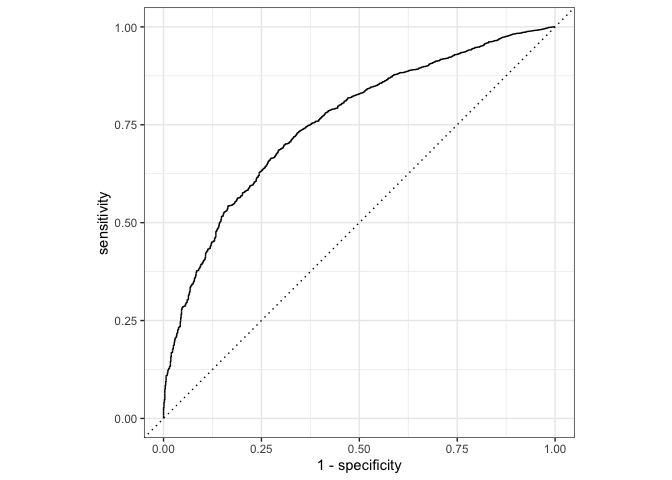

1. **Dataset Exploration**  
   - Load and examine the **Can Path Student Dataset**. 

``` r
data<-read.csv("mice_all_imp.csv")
data <- data %>% mutate_at(3, factor)
data <- data %>% mutate_at(5:6, factor)
data <- data %>% mutate_at(8:12, factor)
data <- data %>% mutate_at(15:81, factor)
data <- data %>% mutate_at(83:93, factor)

data$ID <- NULL
data$ADM_STUDY_ID <- NULL
```
   - Conduct an initial exploratory data analysis (EDA) to understand key features and relationships.  
We are going to use Diabatic as a predictor in the model. 

Diabctic (DIS_DIAB_EVER)  has 3 catagories:
0 - "Never had diabetes"
1-  "Ever had diabetes"
2 - "Presumed-Never had diabetes"

let see the frequency distribution of diabetic disease


``` r
table(data$DIS_DIAB_EVER)
```

```
## 
##     0     1     2 
## 36714  3114  1359
```
Let’s recode the variable DIS_DIAB_EVER into Ever had diabetes as Yes (1) , and Never had diabetes and presumed-Never had diabetes as No (0).

``` r
data <- data %>%
	mutate(diabetes = case_when(
		DIS_DIAB_EVER == 0 ~ 0,
		DIS_DIAB_EVER == 1 ~ 1,
		DIS_DIAB_EVER == 2 ~ 0)) %>%
		mutate(diabetes = as.factor(diabetes))
table(data$DIS_DIAB_EVER, data$diabetes)
```

```
##    
##         0     1
##   0 36714     0
##   1     0  3114
##   2  1359     0
```

``` r
data$DIS_DIAB_EVER <- NULL
```

``` r
table <- tableby(~diabetes   
                            , data=data)
knitr::kable(summary(table), caption = "Table 1 : Frequency distribution", booktabs = TRUE, "pipe")
```


Table: Table 1 : Frequency distribution

|                    |Overall (N=41187) |
|:-------------------|:-----------------|
|**diabetes**        |                  |
|&nbsp;&nbsp;&nbsp;0 |38073 (92.4%)     |
|&nbsp;&nbsp;&nbsp;1 |3114 (7.6%)       |

``` r
ggplot(data) + 
    geom_bar(aes(diabetes))
```

<!-- -->


From the table and graph we can say that, 7.6% of the study population has diabetes (1), while the majority (92.4%) does not (0). So we can say that the prevalence of diabetes is low in the dataset. we will use Synthetic Minority Over-sampling Technique (SMOTE) to incease diabetes cases.

   - Handle missing data, outliers, or inconsistencies if necessary.  
   
The dataset has been cleaned by using Multivariate Imputation by Chained Equations method.
<!-- We have selected following variable for our analysis  -->

<!-- SDC_AGE_CALC: Participant's age at questionnaire completion, calculated from birth date and date of questionnaire completion. -->
<!-- SDC_EDU_LEVEL: Highest level of education completed by the participant. -->
<!-- PM_BMI_SR: Body Mass Index. -->
<!-- WRK_FULL_TIME: Full-time employed. -->
<!-- SMK_CIG_EVER: Ever smoked 100 cigarettes or more. -->
<!-- SDC_INCOME: Household income before taxes -->
<!-- PA_TOTAL_SHORT: Total physical activity MET-minutes/week -->
<!-- HS_ROUTINE_VISIT_EVER: Ever had routine medical check-up. -->
<!-- PSE_ADULT_WRK_DURATION: Duration of passive smoking exposure during adulthood at work. -->
<!-- DIS_RESP_SLEEP_APNEA_EVER: Occurrence of sleep apnea. -->
<!-- SDC_EDU_LEVEL_AGE: Age highest level education completed. -->
<!-- SDC_GENDER: Gender of the participant. -->

<!-- ```{r} -->
<!-- data_small <- data %>%  -->
<!-- select (diabetes, SDC_AGE_CALC, SDC_EDU_LEVEL, PM_BMI_SR, WRK_FULL_TIME, SMK_CIG_EVER, SDC_INCOME, PA_TOTAL_SHORT, HS_ROUTINE_VISIT_EVER, PSE_ADULT_WRK_DURATION, DIS_RESP_SLEEP_APNEA_EVER, SDC_EDU_LEVEL_AGE, SDC_GENDER) -->
<!-- ``` -->


2. **Baseline Random Forest Model**  
   - Split the dataset into training and testing sets.  

``` r
set.seed(786)


cv_split <- initial_split(data, 
                            strata = diabetes, 
                            prop = 0.70)
```
We have split the main dataset into two parts: the training dataset, where we put 70 percent of all observations, and the test dataset, where we put 30 percent. 

``` r
train_data <- training(cv_split)


test_data  <- testing(cv_split)
```
### Set the number of cores on your computer

``` r
cores <- parallel::detectCores()
cores
```

```
## [1] 11
```
- Implement a baseline Random Forest model with default parameters.  

``` r
rf_model_base <- rand_forest() %>% 
              set_engine("ranger", num.threads = cores) %>% 
              set_mode("classification")
```
## recipe bulding


``` r
diabetes_recipe_base <- 
  recipe(diabetes ~ ., data = train_data) %>% 
  step_smotenc(diabetes, over_ratio = 0.9) %>%
  step_zv(all_predictors()) 
```

## workflow building

``` r
library(recipes)
diabetes_workflow_base <- 
        workflow() %>% 
        add_model(rf_model_base) %>% 
        add_recipe(diabetes_recipe_base)

diabetes_workflow_base
```

```
## ══ Workflow ════════════════════════════════════════════════════════════════════
## Preprocessor: Recipe
## Model: rand_forest()
## 
## ── Preprocessor ────────────────────────────────────────────────────────────────
## 2 Recipe Steps
## 
## • step_smotenc()
## • step_zv()
## 
## ── Model ───────────────────────────────────────────────────────────────────────
## Random Forest Model Specification (classification)
## 
## Engine-Specific Arguments:
##   num.threads = cores
## 
## Computational engine: ranger
```
## Fit the model 


``` r
set.seed(100)

diabetes_workflow_fit_base <- diabetes_workflow_base %>% 
  fit(train_data)

diabetes_workflow_fit_base
```

```
## ══ Workflow [trained] ══════════════════════════════════════════════════════════
## Preprocessor: Recipe
## Model: rand_forest()
## 
## ── Preprocessor ────────────────────────────────────────────────────────────────
## 2 Recipe Steps
## 
## • step_smotenc()
## • step_zv()
## 
## ── Model ───────────────────────────────────────────────────────────────────────
## Ranger result
## 
## Call:
##  ranger::ranger(x = maybe_data_frame(x), y = y, num.threads = ~cores,      verbose = FALSE, seed = sample.int(10^5, 1), probability = TRUE) 
## 
## Type:                             Probability estimation 
## Number of trees:                  500 
## Sample size:                      50595 
## Number of independent variables:  90 
## Mtry:                             9 
## Target node size:                 10 
## Variable importance mode:         none 
## Splitrule:                        gini 
## OOB prediction error (Brier s.):  0.04919564
```

``` r
summary(diabetes_workflow_fit_base)
```

```
##         Length Class      Mode   
## pre     3      stage_pre  list   
## fit     2      stage_fit  list   
## post    1      stage_post list   
## trained 1      -none-     logical
```

## Test the trained model


``` r
pred_diabetes_base_class <- predict(diabetes_workflow_fit_base,
                      new_data = test_data,
                      type = "class")
table(pred_diabetes_base_class$.pred_class)
```

```
## 
##     0     1 
## 12036   321
```

``` r
pred_diabetes_base_prob <- predict(diabetes_workflow_fit_base,
                      new_data = test_data,
                      type = "prob")
head(pred_diabetes_base_prob)
```

```
## # A tibble: 6 × 2
##   .pred_0 .pred_1
##     <dbl>   <dbl>
## 1   0.657  0.343 
## 2   0.966  0.0343
## 3   0.638  0.362 
## 4   0.837  0.163 
## 5   0.740  0.260 
## 6   0.820  0.180
```

``` r
diabetes_results_base <- test_data %>%
  select(diabetes) %>%
  bind_cols(pred_diabetes_base_class, pred_diabetes_base_prob)

head(diabetes_results_base)
```

```
##   diabetes .pred_class   .pred_0   .pred_1
## 1        0           0 0.6566556 0.3433444
## 2        0           0 0.9657373 0.0342627
## 3        0           0 0.6384534 0.3615466
## 4        0           0 0.8373110 0.1626890
## 5        0           0 0.7396683 0.2603317
## 6        0           0 0.8202349 0.1797651
```
   - Evaluate the model using appropriate metrics (e.g., accuracy, precision, recall, F1-score, or ROC-AUC).  
   
## Confusion Matrix

``` r
conf_mat(diabetes_results_base, truth = diabetes,
         estimate = .pred_class)
```

```
##           Truth
## Prediction     0     1
##          0 11223   813
##          1   221   100
```
## Accuracy


``` r
accuracy_base<-accuracy(diabetes_results_base, truth = diabetes,
         estimate = .pred_class)
accuracy_base
```

```
## # A tibble: 1 × 3
##   .metric  .estimator .estimate
##   <chr>    <chr>          <dbl>
## 1 accuracy binary         0.916
```
## Sensitivity


``` r
sensitivity_base<-sens(diabetes_results_base, truth = diabetes,
         estimate = .pred_class)
sensitivity_base
```

```
## # A tibble: 1 × 3
##   .metric .estimator .estimate
##   <chr>   <chr>          <dbl>
## 1 sens    binary         0.981
```

## Specificity


``` r
specificity_base<-spec(diabetes_results_base, truth = diabetes,
         estimate = .pred_class)
specificity_base
```

```
## # A tibble: 1 × 3
##   .metric .estimator .estimate
##   <chr>   <chr>          <dbl>
## 1 spec    binary         0.110
```

## F1 Score


``` r
f1_score_base<-f_meas(diabetes_results_base, truth = diabetes,
         estimate = .pred_class)
f1_score_base
```

```
## # A tibble: 1 × 3
##   .metric .estimator .estimate
##   <chr>   <chr>          <dbl>
## 1 f_meas  binary         0.956
```
#### Precision


``` r
precision_base  <- precision(diabetes_results_base, truth = diabetes,
         estimate = .pred_class) 

precision_base
```

```
## # A tibble: 1 × 3
##   .metric   .estimator .estimate
##   <chr>     <chr>          <dbl>
## 1 precision binary         0.932
```

## ROC Curve


``` r
roc_auc(diabetes_results_base,
        truth = diabetes,
        .pred_0)
```

```
## # A tibble: 1 × 3
##   .metric .estimator .estimate
##   <chr>   <chr>          <dbl>
## 1 roc_auc binary         0.756
```

``` r
roc_curve <- diabetes_results_base %>%
  roc_curve(truth = diabetes, .pred_0) %>%
  autoplot()

plot(roc_curve)
```

<!-- -->
The ROC-AUC score of 0.7556 indicates that the model has moderate to good discriminative ability in distinguishing between positive and negative cases. It has a 75.56% chance of correctly ranking a positive instance higher than a negative one.

3. **Hyperparameter Tuning**  

# Build the model object 

``` r
rf_model_tune <- rand_forest(mtry = tune(), min_n = tune(), trees = 100) %>% 
              set_engine("ranger", num.threads = cores) %>% 
              set_mode("classification")
```

# Recipe


``` r
diabetes_recipe_tune <- 
  recipe(diabetes ~ ., data = train_data) %>% 
   step_smotenc(diabetes, over_ratio = 0.9) %>%
  step_zv(all_predictors()) ### Remove columns from the data when the training set data have a single value. Zero variance predictor
```

# Create a workflow


``` r
diabetes_workflow_tune <- 
        workflow() %>% 
        add_model(rf_model_tune) %>% 
        add_recipe(diabetes_recipe_tune)

diabetes_workflow_tune
```

```
## ══ Workflow ════════════════════════════════════════════════════════════════════
## Preprocessor: Recipe
## Model: rand_forest()
## 
## ── Preprocessor ────────────────────────────────────────────────────────────────
## 2 Recipe Steps
## 
## • step_smotenc()
## • step_zv()
## 
## ── Model ───────────────────────────────────────────────────────────────────────
## Random Forest Model Specification (classification)
## 
## Main Arguments:
##   mtry = tune()
##   trees = 100
##   min_n = tune()
## 
## Engine-Specific Arguments:
##   num.threads = cores
## 
## Computational engine: ranger
```

## fit model


``` r
set.seed(100)

folds <- vfold_cv(train_data, v = 10) 

rf_grid <- grid_regular(
              mtry(range = c(1, 30)),
              min_n(range = c(5, 50)),
              levels = 5  
            )

rf_grid
```

```
## # A tibble: 25 × 2
##     mtry min_n
##    <int> <int>
##  1     1     5
##  2     8     5
##  3    15     5
##  4    22     5
##  5    30     5
##  6     1    16
##  7     8    16
##  8    15    16
##  9    22    16
## 10    30    16
## # ℹ 15 more rows
```


``` r
diabetes_fit_tune <- tune_grid(
                diabetes_workflow_tune,
                resamples = folds,
                grid = rf_grid, 
                control = control_resamples(save_pred = TRUE, 
                                                  verbose = FALSE))

diabetes_fit_tune
```

```
## # Tuning results
## # 10-fold cross-validation 
## # A tibble: 10 × 5
##    splits               id     .metrics          .notes           .predictions
##    <list>               <chr>  <list>            <list>           <list>      
##  1 <split [25947/2883]> Fold01 <tibble [75 × 6]> <tibble [0 × 3]> <tibble>    
##  2 <split [25947/2883]> Fold02 <tibble [75 × 6]> <tibble [0 × 3]> <tibble>    
##  3 <split [25947/2883]> Fold03 <tibble [75 × 6]> <tibble [0 × 3]> <tibble>    
##  4 <split [25947/2883]> Fold04 <tibble [75 × 6]> <tibble [0 × 3]> <tibble>    
##  5 <split [25947/2883]> Fold05 <tibble [75 × 6]> <tibble [0 × 3]> <tibble>    
##  6 <split [25947/2883]> Fold06 <tibble [75 × 6]> <tibble [0 × 3]> <tibble>    
##  7 <split [25947/2883]> Fold07 <tibble [75 × 6]> <tibble [0 × 3]> <tibble>    
##  8 <split [25947/2883]> Fold08 <tibble [75 × 6]> <tibble [0 × 3]> <tibble>    
##  9 <split [25947/2883]> Fold09 <tibble [75 × 6]> <tibble [0 × 3]> <tibble>    
## 10 <split [25947/2883]> Fold10 <tibble [75 × 6]> <tibble [0 × 3]> <tibble>
```
Evaluatinng the result


``` r
diabetes_fit_tune %>%
  collect_metrics() %>%
  filter(.metric == "accuracy") %>%
  select(mean, min_n, mtry) %>%
  pivot_longer(min_n:mtry,
    values_to = "value",
    names_to = "parameter"
  ) %>%
  ggplot(aes(value, mean, color = parameter)) +
  geom_point(show.legend = FALSE) +
  facet_wrap(~parameter, scales = "free_x") +
  labs(x = NULL, y = "Accuracy")
```

<!-- -->

``` r
diabetes_fit_tune %>%
  collect_metrics() %>%
  filter(.metric == "accuracy") %>%
  mutate(min_n = factor(min_n)) %>%
  ggplot(aes(mtry, mean, color = min_n)) +
  geom_line(alpha = 0.5, size = 1.5) +
  geom_point() +
  labs(y = "Accuracy")
```

```
## Warning: Using `size` aesthetic for lines was deprecated in ggplot2 3.4.0.
## ℹ Please use `linewidth` instead.
## This warning is displayed once every 8 hours.
## Call `lifecycle::last_lifecycle_warnings()` to see where this warning was
## generated.
```

<!-- -->
from the plot, the best tuned model have mtry around 8 and min_n of around 5 and trees of 100.
# Collect the results

``` r
rf_best_tune <- 
  diabetes_fit_tune %>% 
  select_best(metric = "accuracy")

rf_best_tune
```

```
## # A tibble: 1 × 3
##    mtry min_n .config              
##   <int> <int> <chr>                
## 1     8     5 Preprocessor1_Model02
```
The best model is Preprocessor1_Model02 with mtry 8, min_n 5 and trees 100.

### Finalizing the best model 


``` r
final_rf_model <- finalize_model(rf_model_tune, rf_best_tune)
```

### Creating final workflow
 

``` r
rf_workflow_final <- workflow() %>% 
  add_model(final_rf_model) %>% 
  add_recipe(diabetes_recipe_tune) 
```


## Fit the model 


``` r
set.seed(100)

diabetes_workflow_fit_tune <- rf_workflow_final %>% 
  fit(train_data)

diabetes_workflow_fit_tune
```

```
## ══ Workflow [trained] ══════════════════════════════════════════════════════════
## Preprocessor: Recipe
## Model: rand_forest()
## 
## ── Preprocessor ────────────────────────────────────────────────────────────────
## 2 Recipe Steps
## 
## • step_smotenc()
## • step_zv()
## 
## ── Model ───────────────────────────────────────────────────────────────────────
## Ranger result
## 
## Call:
##  ranger::ranger(x = maybe_data_frame(x), y = y, mtry = min_cols(~8L,      x), num.trees = ~100, min.node.size = min_rows(~5L, x), num.threads = ~cores,      verbose = FALSE, seed = sample.int(10^5, 1), probability = TRUE) 
## 
## Type:                             Probability estimation 
## Number of trees:                  100 
## Sample size:                      50595 
## Number of independent variables:  90 
## Mtry:                             8 
## Target node size:                 5 
## Variable importance mode:         none 
## Splitrule:                        gini 
## OOB prediction error (Brier s.):  0.04779741
```

``` r
summary(diabetes_workflow_fit_tune)
```

```
##         Length Class      Mode   
## pre     3      stage_pre  list   
## fit     2      stage_fit  list   
## post    1      stage_post list   
## trained 1      -none-     logical
```

## Test the trained model


``` r
pred_diabetes_tune_class <- predict(diabetes_workflow_fit_tune,
                      new_data = test_data,
                      type = "class")
table(pred_diabetes_tune_class$.pred_class)
```

```
## 
##     0     1 
## 12035   322
```

``` r
pred_diabetes_tune_prob <- predict(diabetes_workflow_fit_tune,
                      new_data = test_data,
                      type = "prob")
head(pred_diabetes_tune_prob)
```

```
## # A tibble: 6 × 2
##   .pred_0 .pred_1
##     <dbl>   <dbl>
## 1   0.726  0.274 
## 2   0.967  0.0333
## 3   0.560  0.440 
## 4   0.885  0.115 
## 5   0.701  0.299 
## 6   0.813  0.187
```

``` r
diabetes_results_tune <- test_data %>%
  select(diabetes) %>%
  bind_cols(pred_diabetes_tune_class, pred_diabetes_tune_prob)

head(diabetes_results_tune)
```

```
##   diabetes .pred_class   .pred_0    .pred_1
## 1        0           0 0.7258370 0.27416300
## 2        0           0 0.9666667 0.03333333
## 3        0           0 0.5599778 0.44002222
## 4        0           0 0.8853333 0.11466667
## 5        0           0 0.7006905 0.29930952
## 6        0           0 0.8130000 0.18700000
```
   - Evaluate the model using appropriate metrics (e.g., accuracy, precision, recall, F1-score, or ROC-AUC).  
   
## Confusion Matrix

``` r
conf_mat(diabetes_results_tune, truth = diabetes,
         estimate = .pred_class)
```

```
##           Truth
## Prediction     0     1
##          0 11219   816
##          1   225    97
```
## Accuracy


``` r
accuracy_tune<-accuracy(diabetes_results_tune, truth = diabetes,
         estimate = .pred_class)
accuracy_tune
```

```
## # A tibble: 1 × 3
##   .metric  .estimator .estimate
##   <chr>    <chr>          <dbl>
## 1 accuracy binary         0.916
```
## Sensitivity


``` r
sensitivity_tune<-sens(diabetes_results_tune, truth = diabetes,
         estimate = .pred_class)
sensitivity_tune
```

```
## # A tibble: 1 × 3
##   .metric .estimator .estimate
##   <chr>   <chr>          <dbl>
## 1 sens    binary         0.980
```

## Specificity


``` r
specificity_tune<-spec(diabetes_results_tune, truth = diabetes,
         estimate = .pred_class)
specificity_tune
```

```
## # A tibble: 1 × 3
##   .metric .estimator .estimate
##   <chr>   <chr>          <dbl>
## 1 spec    binary         0.106
```

## F1 Score


``` r
f1_score_tune<-f_meas(diabetes_results_tune, truth = diabetes,
         estimate = .pred_class)
f1_score_tune
```

```
## # A tibble: 1 × 3
##   .metric .estimator .estimate
##   <chr>   <chr>          <dbl>
## 1 f_meas  binary         0.956
```
#### Precision


``` r
precision_tune  <- precision(diabetes_results_tune, truth = diabetes,
         estimate = .pred_class) 

precision_tune
```

```
## # A tibble: 1 × 3
##   .metric   .estimator .estimate
##   <chr>     <chr>          <dbl>
## 1 precision binary         0.932
```

## ROC Curve


``` r
roc_auc(diabetes_results_tune,
        truth = diabetes,
        .pred_0)
```

```
## # A tibble: 1 × 3
##   .metric .estimator .estimate
##   <chr>   <chr>          <dbl>
## 1 roc_auc binary         0.753
```

``` r
roc_curve_tune <- diabetes_results_tune %>%
  roc_curve(truth = diabetes, .pred_0) %>%
  autoplot()

plot(roc_curve_tune)
```

<!-- -->
The ROC-AUC score of 0.7534607 indicates that the model has moderate to good discriminative ability in distinguishing between positive and negative cases. It has a 75.34% chance of correctly ranking a positive instance higher than a negative one.

### **Model Comparisons**  

#### Combine metrics into a data frame


``` r
tune_metrics <- data.frame(
  variable=c("accuracy_tune","sensitivity_tune", "specificity_tune", "precision_tune","f_score_tune"),
  estimate = c(accuracy_tune$.estimate,sensitivity_tune$.estimate,specificity_tune$.estimate,
               precision_tune$.estimate,f1_score_tune$.estimate))

tune_metrics %>% 
  head()
```

```
##           variable  estimate
## 1    accuracy_tune 0.9157563
## 2 sensitivity_tune 0.9803390
## 3 specificity_tune 0.1062432
## 4   precision_tune 0.9321978
## 5     f_score_tune 0.9556625
```

``` r
base_metrics <- data.frame(
  variable=c("accuracy_base","sensitivity_base", "specificity_base", "precision_base","f_score_base"),
  estimate = c(accuracy_base$.estimate,sensitivity_base$.estimate,specificity_base$.estimate,
               precision_base$.estimate,f1_score_base$.estimate))

base_metrics %>% 
  head()
```

```
##           variable  estimate
## 1    accuracy_base 0.9163227
## 2 sensitivity_base 0.9806886
## 3 specificity_base 0.1095290
## 4   precision_base 0.9324526
## 5     f_score_base 0.9559625
```

``` r
metrics_combined <- bind_rows(tune_metrics, base_metrics)

metrics_combined %>% 
  glimpse()
```

```
## Rows: 10
## Columns: 2
## $ variable <chr> "accuracy_tune", "sensitivity_tune", "specificity_tune", "pre…
## $ estimate <dbl> 0.9157563, 0.9803390, 0.1062432, 0.9321978, 0.9556625, 0.9163…
```

``` r
metrics_combined
```

```
##            variable  estimate
## 1     accuracy_tune 0.9157563
## 2  sensitivity_tune 0.9803390
## 3  specificity_tune 0.1062432
## 4    precision_tune 0.9321978
## 5      f_score_tune 0.9556625
## 6     accuracy_base 0.9163227
## 7  sensitivity_base 0.9806886
## 8  specificity_base 0.1095290
## 9    precision_base 0.9324526
## 10     f_score_base 0.9559625
```
### Compare the ROC curve 


``` r
roc_base <- diabetes_results_base %>%
  roc_curve(truth = diabetes, .pred_0) %>%
  mutate(Model = "Base Model")

roc_tune <- diabetes_results_tune %>%
  roc_curve(truth = diabetes, .pred_0) %>%
  mutate(Model = "Tuned Model")
combined_roc <- bind_rows(roc_base, roc_tune)
```


``` r
# Create the plot
combined_plot <- ggplot(combined_roc, aes(x = 1 - specificity, y = sensitivity, color = Model)) +
  geom_path(linewidth = 1) +
  geom_abline(lty = 3, color = "gray") +
  labs(title = "ROC Curve Comparison",
       x = "1 - Specificity (False Positive Rate)",
       y = "Sensitivity (True Positive Rate)") +
  theme_minimal() +
  scale_color_manual(values = c("#E69F00", "#56B4E9")) + # Optional custom colors
  coord_equal()
```


``` r
print(combined_plot)
```

<!-- -->


### Accuracy Comparison


``` r
accuracy_compare <- metrics_combined %>% 
  filter(variable %in% c("accuracy_base", "accuracy_tune"))
accuracy_compare
```

```
##        variable  estimate
## 1 accuracy_tune 0.9157563
## 2 accuracy_base 0.9163227
```

#### Visualizing accuracy comparison 

``` r
ggplot(data = accuracy_compare, aes(x = variable, y = estimate))+
  geom_segment(aes(x = variable, xend = variable, yend = estimate, y = 0))+
  geom_point(size = 4, colour = "#a13")+
  geom_text(aes(label = round(estimate, 2)), hjust = -0.2, vjust = 0.5, color = "black")+
  coord_flip()
```

<!-- -->
### sensitivity Comparison


``` r
sensitivity_compare <- metrics_combined %>% 
  filter(variable %in% c("sensitivity_tune", "sensitivity_base"))
sensitivity_compare
```

```
##           variable  estimate
## 1 sensitivity_tune 0.9803390
## 2 sensitivity_base 0.9806886
```

#### Visualizing sensitivity comparison


``` r
ggplot(data = sensitivity_compare, aes(x = variable, y = estimate))+
  geom_segment(aes(x = variable, xend = variable, yend = estimate, y = 0))+
  geom_point(size = 4, colour = "#a13")+
  geom_text(aes(label = round(estimate, 2)), hjust = -0.2, vjust = 0.5, color = "black")+
  coord_flip()
```

<!-- -->


### Precision Comparison


``` r
precision_compare <- metrics_combined %>% 
  filter(variable %in% c("precision_tune", "precision_base"))
precision_compare
```

```
##         variable  estimate
## 1 precision_tune 0.9321978
## 2 precision_base 0.9324526
```

#### Visualizing precision comparison


``` r
ggplot(data = precision_compare, aes(x = variable, y = estimate))+
  geom_segment(aes(x = variable, xend = variable, yend = estimate, y = 0))+
  geom_point(size = 4, colour = "#a13")+
  geom_text(aes(label = round(estimate, 2)), hjust = -0.2, vjust = 0.5, color = "black")+
  coord_flip()
```

<!-- -->
**Performance Analysis**

1.	Contrary to typical expectations, the base model slightly outperforms the tuned model across all metrics.

2.	The small differences (all < 0.005) suggest negligible practical significance.

3.	Both models achieve excellent sensitivity (~98%) but very poor specificity (~10.6-11%). This indicates both models are excellent at identifying positive cases but perform poorly at identifying negatives.

4.	The high precision (~93%) suggests false positives are relatively rare when predictions are positive.

**Potential Reasons for Results**

1.	The extremely high sensitivity with low specificity suggests a severe class imbalance.

2.	Both models may be biased toward predicting the majority class.

3.	The tuning process may have failed to find better parameters.

4.	The search space might have been too narrow or improperly defined.

