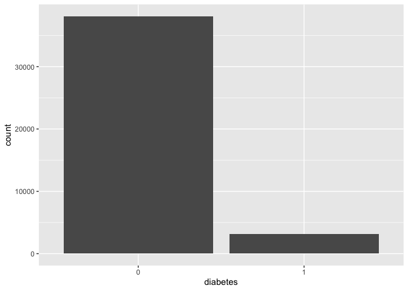
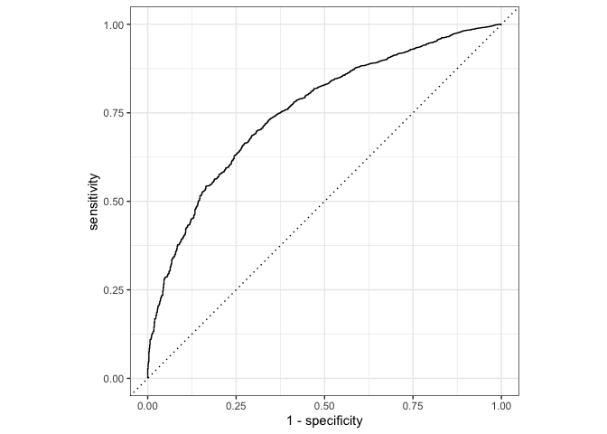

1. **Dataset Exploration**  
   - Load and examine the **Can Path Student Dataset**. 

``` r
data<-read.csv("mice_all_imp.csv")
data <- data %>% mutate_at(3, factor)
data <- data %>% mutate_at(5:6, factor)
data <- data %>% mutate_at(8:12, factor)
data <- data %>% mutate_at(15:81, factor)
data <- data %>% mutate_at(83:93, factor)

data$ID <- NULL
data$ADM_STUDY_ID <- NULL
```
   - Conduct an initial exploratory data analysis (EDA) to understand key features and relationships.  
We are going to use Diabatic as a predictor in the model. 

Diabctic (DIS_DIAB_EVER)  has 3 catagories:
0 - "Never had diabetes"
1-  "Ever had diabetes"
2 - "Presumed-Never had diabetes"

let see the frequency distribution of diabetic disease


``` r
table(data$DIS_DIAB_EVER)
```

```
## 
##     0     1     2 
## 36714  3114  1359
```
Let’s recode the variable DIS_DIAB_EVER into Ever had diabetes as Yes (1) , and Never had diabetes and presumed-Never had diabetes as No (0).

``` r
data <- data %>%
	mutate(diabetes = case_when(
		DIS_DIAB_EVER == 0 ~ 0,
		DIS_DIAB_EVER == 1 ~ 1,
		DIS_DIAB_EVER == 2 ~ 0)) %>%
		mutate(diabetes = as.factor(diabetes))
table(data$DIS_DIAB_EVER, data$diabetes)
```

```
##    
##         0     1
##   0 36714     0
##   1     0  3114
##   2  1359     0
```

``` r
data$DIS_DIAB_EVER <- NULL
```

``` r
table <- tableby(~diabetes   
                            , data=data)
knitr::kable(summary(table), caption = "Table 1 : Frequency distribution", booktabs = TRUE, "pipe")
```


Table: Table 1 : Frequency distribution

|                    |Overall (N=41187) |
|:-------------------|:-----------------|
|**diabetes**        |                  |
|&nbsp;&nbsp;&nbsp;0 |38073 (92.4%)     |
|&nbsp;&nbsp;&nbsp;1 |3114 (7.6%)       |

``` r
ggplot(data) + 
    geom_bar(aes(diabetes))
```

<!-- -->


From the table and graph we can say that, 7.6% of the study population has diabetes (1), while the majority (92.4%) does not (0). So we can say that the prevalence of diabetes is low in the dataset. we will use Synthetic Minority Over-sampling Technique (SMOTE) to incease diabetes cases.

   - Handle missing data, outliers, or inconsistencies if necessary.  
   
The dataset has been cleaned by using Multivariate Imputation by Chained Equations method.
<!-- We have selected following variable for our analysis  -->

<!-- SDC_AGE_CALC: Participant's age at questionnaire completion, calculated from birth date and date of questionnaire completion. -->
<!-- SDC_EDU_LEVEL: Highest level of education completed by the participant. -->
<!-- PM_BMI_SR: Body Mass Index. -->
<!-- WRK_FULL_TIME: Full-time employed. -->
<!-- SMK_CIG_EVER: Ever smoked 100 cigarettes or more. -->
<!-- SDC_INCOME: Household income before taxes -->
<!-- PA_TOTAL_SHORT: Total physical activity MET-minutes/week -->
<!-- HS_ROUTINE_VISIT_EVER: Ever had routine medical check-up. -->
<!-- PSE_ADULT_WRK_DURATION: Duration of passive smoking exposure during adulthood at work. -->
<!-- DIS_RESP_SLEEP_APNEA_EVER: Occurrence of sleep apnea. -->
<!-- SDC_EDU_LEVEL_AGE: Age highest level education completed. -->
<!-- SDC_GENDER: Gender of the participant. -->

<!-- ```{r} -->
<!-- data_small <- data %>%  -->
<!-- select (diabetes, SDC_AGE_CALC, SDC_EDU_LEVEL, PM_BMI_SR, WRK_FULL_TIME, SMK_CIG_EVER, SDC_INCOME, PA_TOTAL_SHORT, HS_ROUTINE_VISIT_EVER, PSE_ADULT_WRK_DURATION, DIS_RESP_SLEEP_APNEA_EVER, SDC_EDU_LEVEL_AGE, SDC_GENDER) -->
<!-- ``` -->


2. **Baseline Random Forest Model**  
   - Split the dataset into training and testing sets.  

``` r
set.seed(786)


cv_split <- initial_split(data, 
                            strata = diabetes, 
                            prop = 0.70)
```
We have split the main dataset into two parts: the training dataset, where we put 70 percent of all observations, and the test dataset, where we put 30 percent. 

``` r
train_data <- training(cv_split)


test_data  <- testing(cv_split)
```
### Set the number of cores on your computer

``` r
cores <- parallel::detectCores()
cores
```

```
## [1] 11
```
- Implement a baseline Random Forest model with default parameters.  

``` r
rf_model_base <- rand_forest() %>% 
              set_engine("ranger", num.threads = cores) %>% 
              set_mode("classification")
```
## recipe bulding


``` r
diabetes_recipe <- 
  recipe(diabetes ~ ., data = train_data) %>% 
  step_smotenc(diabetes, over_ratio = 0.9) %>%
  step_zv(all_predictors()) 
```

## workflow building

``` r
library(recipes)
diabetes_workflow <- 
        workflow() %>% 
        add_model(rf_model_base) %>% 
        add_recipe(diabetes_recipe)

diabetes_workflow
```

```
## ══ Workflow ════════════════════════════════════════════════════════════════════
## Preprocessor: Recipe
## Model: rand_forest()
## 
## ── Preprocessor ────────────────────────────────────────────────────────────────
## 2 Recipe Steps
## 
## • step_smotenc()
## • step_zv()
## 
## ── Model ───────────────────────────────────────────────────────────────────────
## Random Forest Model Specification (classification)
## 
## Engine-Specific Arguments:
##   num.threads = cores
## 
## Computational engine: ranger
```
## Fit the model 


``` r
set.seed(100)

diabetes_workflow_fit <- diabetes_workflow %>% 
  fit(train_data)

diabetes_workflow_fit
```

```
## ══ Workflow [trained] ══════════════════════════════════════════════════════════
## Preprocessor: Recipe
## Model: rand_forest()
## 
## ── Preprocessor ────────────────────────────────────────────────────────────────
## 2 Recipe Steps
## 
## • step_smotenc()
## • step_zv()
## 
## ── Model ───────────────────────────────────────────────────────────────────────
## Ranger result
## 
## Call:
##  ranger::ranger(x = maybe_data_frame(x), y = y, num.threads = ~cores,      verbose = FALSE, seed = sample.int(10^5, 1), probability = TRUE) 
## 
## Type:                             Probability estimation 
## Number of trees:                  500 
## Sample size:                      50595 
## Number of independent variables:  90 
## Mtry:                             9 
## Target node size:                 10 
## Variable importance mode:         none 
## Splitrule:                        gini 
## OOB prediction error (Brier s.):  0.04919564
```

``` r
summary(diabetes_workflow_fit)
```

```
##         Length Class      Mode   
## pre     3      stage_pre  list   
## fit     2      stage_fit  list   
## post    1      stage_post list   
## trained 1      -none-     logical
```

## Test the trained model


``` r
pred_diabetes_class <- predict(diabetes_workflow_fit,
                      new_data = test_data,
                      type = "class")
table(pred_diabetes_class$.pred_class)
```

```
## 
##     0     1 
## 12036   321
```

``` r
pred_diabetes_prob <- predict(diabetes_workflow_fit,
                      new_data = test_data,
                      type = "prob")
head(pred_diabetes_prob)
```

```
## # A tibble: 6 × 2
##   .pred_0 .pred_1
##     <dbl>   <dbl>
## 1   0.657  0.343 
## 2   0.966  0.0343
## 3   0.638  0.362 
## 4   0.837  0.163 
## 5   0.740  0.260 
## 6   0.820  0.180
```

``` r
diabetes_results <- test_data %>%
  select(diabetes) %>%
  bind_cols(pred_diabetes_class, pred_diabetes_prob)

head(diabetes_results)
```

```
##   diabetes .pred_class   .pred_0   .pred_1
## 1        0           0 0.6566556 0.3433444
## 2        0           0 0.9657373 0.0342627
## 3        0           0 0.6384534 0.3615466
## 4        0           0 0.8373110 0.1626890
## 5        0           0 0.7396683 0.2603317
## 6        0           0 0.8202349 0.1797651
```
   - Evaluate the model using appropriate metrics (e.g., accuracy, precision, recall, F1-score, or ROC-AUC).  
   
## Confusion Matrix

``` r
conf_mat(diabetes_results, truth = diabetes,
         estimate = .pred_class)
```

```
##           Truth
## Prediction     0     1
##          0 11223   813
##          1   221   100
```
## Accuracy


``` r
accuracy(diabetes_results, truth = diabetes,
         estimate = .pred_class)
```

```
## # A tibble: 1 × 3
##   .metric  .estimator .estimate
##   <chr>    <chr>          <dbl>
## 1 accuracy binary         0.916
```
## Sensitivity


``` r
sens(diabetes_results, truth = diabetes,
         estimate = .pred_class)
```

```
## # A tibble: 1 × 3
##   .metric .estimator .estimate
##   <chr>   <chr>          <dbl>
## 1 sens    binary         0.981
```

## Specificity


``` r
spec(diabetes_results, truth = diabetes,
         estimate = .pred_class)
```

```
## # A tibble: 1 × 3
##   .metric .estimator .estimate
##   <chr>   <chr>          <dbl>
## 1 spec    binary         0.110
```

## F1 Score


``` r
f_meas(diabetes_results, truth = diabetes,
         estimate = .pred_class)
```

```
## # A tibble: 1 × 3
##   .metric .estimator .estimate
##   <chr>   <chr>          <dbl>
## 1 f_meas  binary         0.956
```

## ROC Curve


``` r
roc_auc(diabetes_results,
        truth = diabetes,
        .pred_0)
```

```
## # A tibble: 1 × 3
##   .metric .estimator .estimate
##   <chr>   <chr>          <dbl>
## 1 roc_auc binary         0.756
```

``` r
roc_curve <- diabetes_results %>%
  roc_curve(truth = diabetes, .pred_0) %>%
  autoplot()

plot(roc_curve)
```

<!-- -->
The ROC-AUC score of 0.7556 indicates that the model has moderate to good discriminative ability in distinguishing between positive and negative cases. It has a 75.56% chance of correctly ranking a positive instance higher than a negative one.


3. **Hyperparameter Tuning**  
   - Identify key hyperparameters to tune.  
   - Use techniques to find the optimal hyperparameter configuration.  
   - Document the tuning process, including parameters tested and evaluation results.  

4. **Model Comparisons**  
   - Compare the tuned Random Forest model against:  
     - The baseline Random Forest model.  
   - Analyze differences in performance using quantitative metrics and discuss possible reasons for the results.  

5. **Feature Importance Analysis**  
   - Extract and interpret feature importance scores from the Random Forest model.  
   - Visualize the top contributing features and discuss their relevance to the dataset.  
